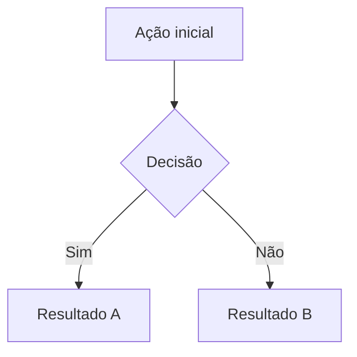
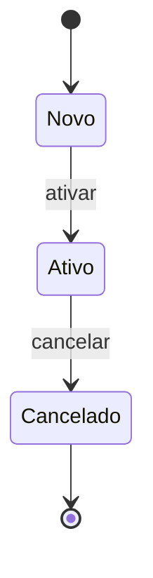

# [Nome do Módulo] — Spec

> Template de SDD (Spec-Driven Development). Preencha antes de codar uma feature nova
> ou ao revisar/documentar um módulo existente. Mantenha em `docs/specs/{modulo}.md`.

**Status:** ⚠️ Rascunho | 🧪 Em revisão | ✅ Aprovado
**Última atualização:** YYYY-MM-DD — @autor
**Código:** `backend/.../{Modulo}Service.cs` · `frontend/src/app/modules/{modulo}/`

---

## 1. Objetivo de Negócio
_Por que esse módulo existe? Qual dor resolve? Quem usa?_

## 2. Escopo
**Inclui:** …
**Não inclui:** …

## 3. Glossário
- **Termo X:** definição curta.

## 4. Atores / Permissões
| Ator | Ações | Permissão |
|------|-------|-----------|
| Operador | … | `modulo:c` |

## 5. Regras de Negócio (invariantes)
Regras que **nunca** podem ser violadas. Numere para referenciar nos fluxos.

- **RN-01:** …
- **RN-02:** …

## 6. Modelo de Dados
### Entidades
| Entidade | Campos-chave | Relacionamentos |
|----------|--------------|-----------------|
| Foo | Id, Nome, Ativo | FK Bar, 1:N Baz |

### Enums
- `StatusX`: Novo, Ativo, Cancelado.

## 7. Fluxos

### Fluxo principal — Nome do fluxo

Passos comentados:
1. Ação inicial — …
2. Decisão — aplica **RN-01**.
3. …

### Fluxo alternativo — …
_(copie o padrão acima para cada fluxo)_

## 8. Máquina de Estado (se aplicável)

## 9. Contratos de API
| Verbo | Rota | Request | Response | Erros |
|-------|------|---------|----------|-------|
| GET | `/api/foo` | query: `filtro` | `FooListDto[]` | 401 |
| POST | `/api/foo` | `FooFormDto` | `FooDto` | 400 (validação) |

## 10. Validações
| Campo | Regra | Erro |
|-------|-------|------|
| CNPJ | 14 dígitos + dígito verificador | "CNPJ inválido" |

## 11. Integrações Externas
- **ViaCEP:** lookup de endereço ao digitar CEP. Falha silenciosa.
- **…**

## 12. UI — Estrutura
- Modo lista: filtros, grid.
- Modo form: seções X, Y, Z.
- Atalhos: Ctrl+S, F2, Esc.

## 13. Efeitos Colaterais
O que essa ação **dispara** em outros módulos?
- Criar venda → gera CaixaMovimento no caixa aberto.
- …

## 14. Critérios de Aceite
Checklist objetivo pra saber que a feature está pronta.

- [ ] Criar Foo com todos os campos válidos → salva e aparece na lista.
- [ ] Tentar criar Foo duplicado → erro "já existe".
- [ ] …

## 15. Decisões & Tradeoffs
Decisões não-óbvias, com motivo:
- **Soft-delete em vez de hard-delete:** preserva histórico para auditoria fiscal.

## 16. Pendências / Futuro
- [ ] …

## 17. Referências
- Issue #123
- Link pro help (accordion): `help.component.html` — `toggleSecao('modulo')`
