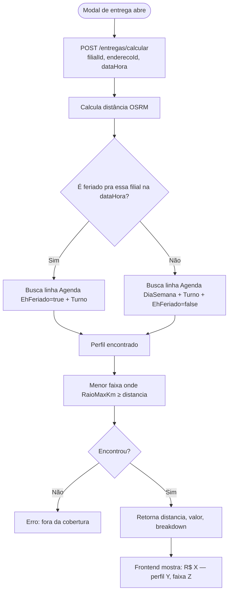
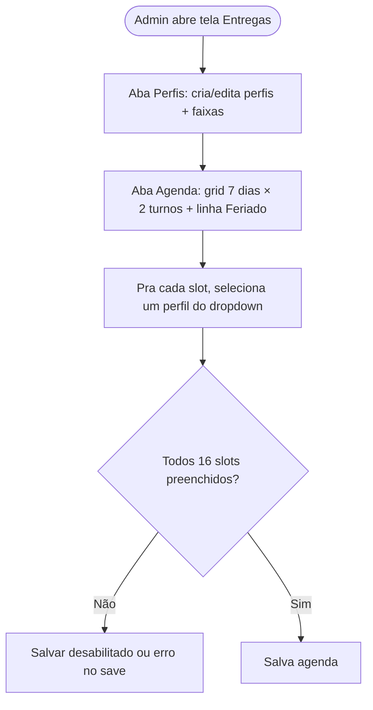
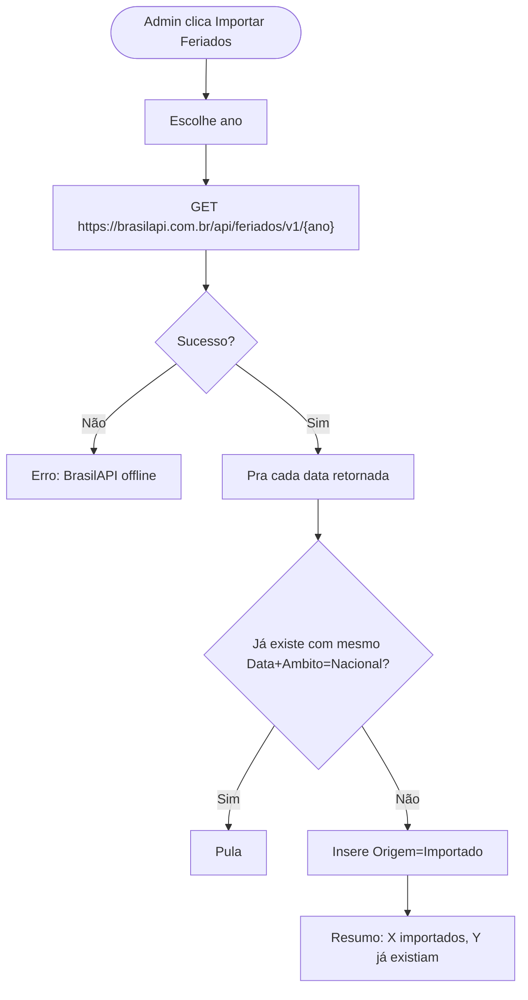
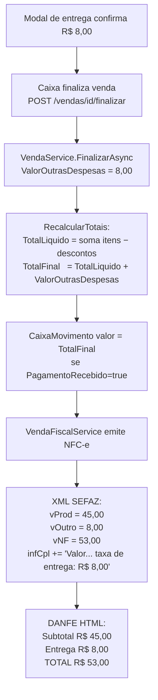
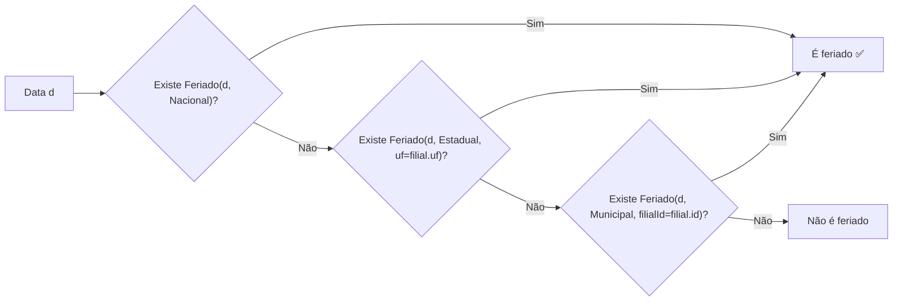

# Entregas — Precificação (Perfis, Faixas, Agenda, Feriados)

**Status:** 🧪 Em revisão
**Última atualização:** 2026-04-19 — @aalessandre
**Código:** `backend/ZulexPharma.Infrastructure/Services/EntregaService.cs` · frontend `modules/entregas-config/` (a criar) + `modules/feriados/` (a criar)
**Depende de:** [entregas (spec implícita do módulo)](#) · [filiais.md](filiais.md)
**Substitui:** o modelo atual de `EntregaFaixa` (simples, só raio × valor por filial)

---

## 1. Objetivo de Negócio

Permitir que cada farmácia cobre **valores de entrega diferentes** conforme:
- **Raio** (já existe): quanto mais longe, maior o valor.
- **Turno** (novo): entrega à noite custa mais (motoboy com adicional noturno).
- **Dia da semana** (novo): fins de semana podem ter tabela diferente.
- **Feriado** (novo): feriados têm precedência e custam mais.

**Dores que resolve:**
- Hoje cobra o mesmo valor 24/7. Motoboy noturno custa mais pro dono, mas ele repassa um valor fixo.
- Dono precisa "pintar" manualmente preços diferentes sábado vs dia útil.
- Feriado vira caso especial só tratado no boca-a-boca.

**Quem usa:** usuários com permissão concedida (esquema padrão do ERP — via cadastro de Grupos/Permissões); atendente (só vê o valor calculado pra cada venda).

---

## 2. Escopo

**Inclui:**
- Cadastro de **Perfis de Preço** (ex: "Diurno Útil", "Noturno", "Feriado").
- Cadastro de **Faixas de Raio** por perfil (continua: `RaioMaxKm × Valor`).
- Cadastro de **Agenda semanal** — pra cada combinação (dia da semana × turno × feriado), qual perfil aplicar.
- Cadastro de **Feriados** com ambito nacional/estadual/municipal. Importação dos nacionais via BrasilAPI.
- Refatoração de `EntregaService.CalcularAsync` para resolver perfil antes da faixa.
- **Remoção** de "Entregas" de Configurações → move pra "Outros Cadastros".
- **Integração fiscal**: valor da entrega cobrado do cliente no cupom NFC-e via campo `<vOutro>` (Outras Despesas Acessórias), com label "Entrega" no DANFE e observação em `<infCpl>`.

**Não inclui:**
- Preço dinâmico por horário específico (ex: "das 22h às 23h cobra +R$5"). Só diurno/noturno fixos.
- Turnos configuráveis por filial (são fixos globais: **Diurno 06–18**, **Noturno 18–06**).
- Mudança de preço depois da venda (se motoboy atrasar, valor cobrado é o da hora da venda).
- Desconto/promoção de entrega (pode ser feature futura).
- Integração com APIs de feriado estadual/municipal (BrasilAPI só tem nacionais).

---

## 3. Glossário

- **Perfil de Preço:** conjunto nomeado de faixas `raio × valor`. Ex: "Diurno Útil" com 0–3km R$5, 3–6km R$8, 6–10km R$12.
- **Faixa (EntregaFaixa):** uma linha dentro de um perfil — `{ PerfilId, RaioMaxKm, Valor, Ordem }`.
- **Turno:** fixo no sistema — **Diurno** (06:00–17:59:59) e **Noturno** (18:00–05:59:59). Não configurável.
- **Agenda:** matriz que mapeia `(DiaSemana, Turno, EhFeriado) → Perfil`. Obriga cobertura total (16 slots por filial).
- **Feriado:** data específica marcada como tal, por âmbito (Nacional/Estadual/Municipal). Precede todas as outras regras.
- **Precedência:** Feriado > Fim de semana > Dia útil + Turno (regra RN-06).

---

## 4. Atores / Permissões

| Ator | Ações | Observação |
|------|-------|-----------|
| Qualquer usuário com permissão | CRUD de Perfis, Faixas, Agenda, Feriados | Permissões concedidas via cadastro de Grupos (`entregas-config`, `feriados`). Respeita esquema padrão: `c`/`i`/`a`/`e`. |
| Atendente / Caixa | Só consulta (via modal de entrega, indireto) | Não tem tela dedicada |
| SISTEMA | Bypass | Como demais módulos críticos |

> Essas telas **não exigem senha do dia** por enquanto (são menos críticas que Filiais). Fica como possibilidade futura se houver abuso.

---

## 5. Regras de Negócio (invariantes)

- **RN-01 — Perfil tem nome único por filial:** nomes de perfil precisam ser únicos dentro de cada filial. Case-insensitive, UPPERCASE.
- **RN-02 — Perfil precisa ter ≥ 1 faixa:** não permite salvar perfil sem faixa. Erro ao tentar excluir a última faixa.
- **RN-03 — Faixas dentro de um perfil têm raios em ordem crescente:** `Ordem` define ordem de exibição; `RaioMaxKm` define cobertura. Validado: não pode ter 2 faixas com mesmo `RaioMaxKm` dentro do mesmo perfil.
- **RN-04 — Turnos fixos globais:** **Diurno** = 06:00:00–17:59:59; **Noturno** = 18:00:00–05:59:59. Hardcoded no backend em `TurnoEntrega.Resolver(DateTime)`.
- **RN-05 — Agenda exige cobertura 100%:** ao salvar, valida que TODOS os 16 slots `(DiaSemana × Turno × EhFeriado)` têm um perfil definido. Se faltar, erro "Agenda incompleta — defina perfil para todos os slots".
- **RN-06 — Precedência no lookup da agenda:** se `IsFeriado(data, filialId) = true`, usa a linha com `EhFeriado=true` do turno correspondente. Senão, usa a linha com `EhFeriado=false` + `DiaSemana` + `Turno`. Nunca usa a linha "comum" quando é feriado.
- **RN-07 — Feriado com ambito:** uma data é feriado pra uma filial se:
  - existe `Feriado { Data, Ambito=Nacional }`, OU
  - existe `Feriado { Data, Ambito=Estadual, Uf=<UF da filial> }`, OU
  - existe `Feriado { Data, Ambito=Municipal, FilialId=<id da filial> }`.
- **RN-08 — Feriados nacionais importados têm flag de origem:** `Origem=Importado` (BrasilAPI) vs `Origem=Manual` (cadastro do usuário). Só Importados não permitem edição manual (ou permitem com aviso).
- **RN-09 — Cálculo no momento da venda, congelado na Entrega:** `CalcularAsync(filialId, enderecoId, dataHora)` usa a `dataHora` fornecida (padrão: agora). O valor retornado é gravado na `Entrega.ValorEntrega` no momento da criação. Alterar agenda depois não muda valores já gravados.
- **RN-10 — Exclusão de perfil em uso:** não permitido. Erro: "Perfil está usado em N slots da agenda ou em M entregas em aberto". Soft-delete com `Ativo=false` opcional (fica fora dos dropdowns, conforme regra global).
- **RN-11 — Exclusão de feriado em uso:** feriados só são consultados pontualmente (por data) — excluir um feriado que já foi aplicado a entregas históricas **não** recalcula valores (imutabilidade fiscal/contábil).
- **RN-12 — Migração preserva dados:** ao aplicar a migration, todas as `EntregaFaixa` existentes são migradas para um perfil auto-criado "PADRÃO" por filial, e a agenda é preenchida com esse perfil em todos os 16 slots. Usuário ajusta depois.
- **RN-13 — Integração fiscal via `vOutro`:** o valor da entrega entra no cupom NFC-e através do campo **`<vOutro>` (Outras Despesas Acessórias)** no bloco `<ICMSTot>`. Isso soma em `vNF` automaticamente: `vNF = vProd − vDesc + vFrete + vSeg + vOutro − vICMSDeson`. Campo é **nativo do XML SEFAZ**, aceito sem ressalvas, zero risco de rejeição.
- **RN-14 — Label "Entrega" no DANFE:** no template HTML do cupom impresso (100% controle interno), a linha do `vOutro` é rotulada como **"Entrega"** em vez de "Outras Despesas". Só quando `venda.ValorOutrasDespesas > 0` — se zero, a linha não aparece.
- **RN-15 — Observação automática em `<infCpl>`:** quando há entrega, o NFC-e builder concatena automaticamente ao campo `<infCpl>` (Informações Complementares): `"Taxa de Entrega: R$ {valor}"`. Texto curto e direto. Aparece no rodapé do cupom E na consulta online pela SEFAZ (via QR code) — cobre o cenário de cliente ariscando depois.
- **RN-16 — Não criar "produto fantasma" ENTREGA:** descartado explicitamente. Motivos: (a) entrega é serviço, não produto; (b) contamina relatórios de venda/estoque/comissão; (c) exige cadastro duplicado por filial; (d) `vOutro` é a convenção fiscal correta pra taxa de entrega própria.
- **RN-17 — Valor de entrega integra o total líquido da venda:** o `Venda.ValorOutrasDespesas` entra no cálculo do total final (`TotalFinal = TotalLiquido + ValorOutrasDespesas`). O `CaixaMovimento` de recebimento usa o total final (cliente paga produtos + entrega juntos). Se a venda for com `PagamentoRecebido=false` (entrega diferida), o total completo fica pendente — baixa no caixa da entrega contabiliza tudo.

---

## 6. Modelo de Dados

### Entidade `EntregaPerfil` (nova)
| Campo | Tipo | Obrig. | Descrição |
|-------|------|--------|-----------|
| `Id` | long | auto | PK |
| `FilialId` | long (FK) | ✅ | Perfil é sempre por filial |
| `Nome` | string | ✅ | Ex: "DIURNO ÚTIL" (UPPERCASE, único por filial) |
| `Ativo` | bool | ✅ | Default true |
| `CriadoEm` | DateTime | auto | |

### Entidade `EntregaFaixa` (alterada — ganha FK `PerfilId`)
| Campo | Tipo | Obrig. | Descrição |
|-------|------|--------|-----------|
| `Id` | long | auto | |
| ~~`FilialId`~~ | — | removido | Agora vem via perfil |
| `PerfilId` | long (FK) | ✅ | FK pra `EntregaPerfil` |
| `RaioMaxKm` | decimal | ✅ | |
| `Valor` | decimal | ✅ | |
| `Ordem` | int | ✅ | Exibição |

### Entidade `EntregaAgenda` (nova)
| Campo | Tipo | Obrig. | Descrição |
|-------|------|--------|-----------|
| `Id` | long | auto | |
| `FilialId` | long (FK) | ✅ | |
| `DiaSemana` | int (1-7) | ✅ | 1=Domingo, ..., 7=Sábado (ISO DayOfWeek + 1) |
| `Turno` | enum | ✅ | `Diurno` ou `Noturno` |
| `EhFeriado` | bool | ✅ | true = linha aplicável em feriados |
| `PerfilId` | long (FK) | ✅ | Qual perfil usar nesse slot |

**Unique constraint:** `(FilialId, DiaSemana, Turno, EhFeriado)` — uma linha por slot.
**Cardinalidade esperada por filial:** 16 linhas (7 dias × 2 turnos + 1 "feriado" × 2 turnos × 7 dias redundantemente) — **correção:** 7 × 2 × 2 = 28 linhas. Ver alternativa abaixo.

> ⚠️ **Alternativa mais enxuta:** em vez de DiaSemana aplicar também pra feriado, feriado **ignora** dia da semana e só depende do turno. Fica `7 × 2 + 1 × 2 = 16 linhas`. Adotado — é mais simples e combina com a realidade (feriado não costuma ter preço diferente por dia).

**Schema final:**
- Se `EhFeriado=false`: `DiaSemana` é obrigatório e a tupla é `(FilialId, DiaSemana, Turno, false)`.
- Se `EhFeriado=true`: `DiaSemana` é `null` e a tupla é `(FilialId, null, Turno, true)`.
- Unique constraint: `(FilialId, DiaSemana, Turno, EhFeriado)` com tratamento de `DiaSemana=null`.

### Entidade `Feriado` (nova)
| Campo | Tipo | Obrig. | Descrição |
|-------|------|--------|-----------|
| `Id` | long | auto | |
| `Data` | DateOnly | ✅ | Apenas data (sem hora) |
| `Nome` | string | ✅ | Ex: "NATAL" |
| `Ambito` | enum | ✅ | `Nacional` / `Estadual` / `Municipal` |
| `Uf` | string(2)? | — | Obrigatório quando `Ambito=Estadual` |
| `FilialId` | long? (FK) | — | Obrigatório quando `Ambito=Municipal` |
| `Origem` | enum | ✅ | `Importado` (BrasilAPI) ou `Manual` |
| `Ativo` | bool | ✅ | Default true |

**Unique:** `(Data, Ambito, Uf ?? '', FilialId ?? 0)` — não duplicar o mesmo feriado.

### Enums novos
- `TurnoEntrega { Diurno = 1, Noturno = 2 }`
- `AmbitoFeriado { Nacional = 1, Estadual = 2, Municipal = 3 }`
- `OrigemFeriado { Manual = 1, Importado = 2 }`

### Entidade `Venda` (ALTERADA — novo campo)
| Campo | Tipo | Descrição |
|-------|------|-----------|
| `ValorOutrasDespesas` | decimal (default 0) | Valor cobrado do cliente como "Outras Despesas" no NFC-e. Popula `<vOutro>` do XML. Hoje só preenchido pela taxa de entrega; futuramente pode virar acumulador (embalagem, taxa extra, etc). |

### Relacionamentos
- `EntregaPerfil 1—N EntregaFaixa` (1 perfil tem N faixas)
- `EntregaPerfil 1—N EntregaAgenda` (1 perfil referenciado em vários slots)
- `Filial 1—N EntregaPerfil` (cada filial tem seus perfis)
- `Filial 1—N EntregaAgenda` (cada filial tem sua agenda de 16 linhas)
- `Filial 1—N Feriado` (para feriados municipais)
- `Entrega N—1 EntregaFaixa` (existente — mantém referência ao valor aplicado)

---

## 7. Fluxos

### Fluxo principal — Cálculo de valor de entrega na venda



### Fluxo — Cadastro de Agenda



### Fluxo — Importar feriados nacionais



### Fluxo — Integração fiscal (valor da entrega no cupom)



**Exemplo concreto do cupom:**
```
 PRODUTOS                        QT  VL UNIT    TOTAL
  1  DIPIRONA 500MG 20CPR         1     15,00   15,00
  2  AMOXICILINA 500MG 21CPR      1     20,00   20,00
  3  BAND-AID 20UN                1     10,00   10,00
 ─────────────────────────────────────────────────────
 SUBTOTAL .......................................  45,00
 Entrega ........................................   8,00
 TOTAL ..........................................  53,00
 ─────────────────────────────────────────────────────
 INFORMAÇÕES COMPLEMENTARES
 Taxa de Entrega: R$ 8,00
```

### Fluxo — Lookup de feriado (RN-07)



---

## 8. Contratos de API

**Base:** `/api/entregas-config` (perfis + faixas + agenda) e `/api/feriados`.

### Perfis e Faixas
| Verbo | Rota | Request | Response |
|-------|------|---------|----------|
| GET | `/entregas-config/perfis?filialId=X` | — | `PerfilDto[]` (inclui faixas) |
| POST | `/entregas-config/perfis` | `PerfilFormDto` (com faixas) | `PerfilDto` |
| PUT | `/entregas-config/perfis/{id}` | `PerfilFormDto` | 200 |
| DELETE | `/entregas-config/perfis/{id}` | — | 200 ou 409 se em uso |

### Agenda
| Verbo | Rota | Request | Response |
|-------|------|---------|----------|
| GET | `/entregas-config/agenda?filialId=X` | — | `AgendaSlotDto[]` (16 linhas) |
| PUT | `/entregas-config/agenda?filialId=X` | `AgendaSlotDto[]` | 200 (valida RN-05) |

### Feriados
| Verbo | Rota | Request | Response |
|-------|------|---------|----------|
| GET | `/feriados?ano=2026&filialId=X` | — | `FeriadoDto[]` |
| POST | `/feriados` | `FeriadoFormDto` | `FeriadoDto` |
| PUT | `/feriados/{id}` | `FeriadoFormDto` | 200 |
| DELETE | `/feriados/{id}` | — | 200 |
| POST | `/feriados/importar?ano=2026` | — | `{ importados: N, existentes: M }` |

### Cálculo de entrega (existente — alterar signature)
| Verbo | Rota | Request | Response |
|-------|------|---------|----------|
| ~~GET~~ POST | `/entregas/calcular` | `{ filialId, enderecoId, dataHora? }` | `{ distanciaKm, valorEntrega, perfilNome, faixaDescricao, entregaFaixaId }` |

> Mudança: o endpoint vira **POST** pra aceitar `dataHora` no body (pode ficar GET se simpler).

---

## 9. Validações

| Campo | Regra | Erro |
|-------|-------|------|
| `EntregaPerfil.Nome` | Não vazio, único por filial | "Nome já existe" |
| `EntregaFaixa.RaioMaxKm` | > 0, único dentro do perfil | "Raio já cadastrado neste perfil" |
| `EntregaFaixa.Valor` | ≥ 0 | "Valor inválido" |
| `EntregaAgenda` | 16 linhas exatas por filial, sem null em `PerfilId` | "Agenda incompleta" |
| `Feriado.Uf` | Obrigatório se `Ambito=Estadual` | "UF é obrigatória" |
| `Feriado.FilialId` | Obrigatório se `Ambito=Municipal` | "Filial é obrigatória" |
| `Feriado.Data` | Única por `(Ambito, Uf, FilialId)` | "Feriado já cadastrado" |

---

## 10. Integrações Externas

### BrasilAPI — Feriados Nacionais
- **Endpoint:** `GET https://brasilapi.com.br/api/feriados/v1/{ano}`
- **Retorno:** `[{ date: "2026-01-01", name: "Confraternização Universal", type: "national" }, ...]`
- **Trigger:** botão "Importar Feriados Nacionais" na tela de feriados
- **Uso:** cria `Feriado { Data, Nome, Ambito=Nacional, Origem=Importado }`
- **Idempotência:** `(Data, Ambito=Nacional)` já existente → skip
- **Falha:** erro modal "BrasilAPI indisponível, tente novamente depois"

---

## 11. UI — Estrutura

### Tela 1 — "Entregas — Faixas e Regras"
**Rota:** `/erp/entregas-config` (dentro de Outros Cadastros)
**Layout:** 3 abas

**Aba 1: Perfis**
- Lista de perfis da filial com totais (N faixas, ativo)
- Inline edit: accordion ou lateral
- Pra cada perfil: tabela de faixas editável (Raio × Valor × Ordem)
- CRUD: adicionar/remover faixas; validação de ordem e unicidade

**Aba 2: Agenda**
- Grid semanal:
  ```
               Diurno    Noturno
  Domingo    [Perfil ▼] [Perfil ▼]
  Segunda    [Perfil ▼] [Perfil ▼]
  ...
  Sábado     [Perfil ▼] [Perfil ▼]
  --- FERIADO ---
  Feriado    [Perfil ▼] [Perfil ▼]
  ```
- Cada célula é um `<select>` com os perfis ativos (regra global RN-13 de Filiais)
- Salvar valida cobertura 100%

**Aba 3: Preview/Teste** (opcional — nice-to-have)
- Simulador: data+hora + raio → qual perfil e valor sairia?
- Útil pra o admin testar a configuração antes de sair pra produção

### Tela 2 — "Feriados"
**Rota:** `/erp/feriados` (dentro de Outros Cadastros)
- Lista filtrada por ano, âmbito, filial
- CRUD inline
- Botão "Importar Nacionais (BrasilAPI)" → modal pra escolher ano
- Feriados `Origem=Importado` marcados com badge "IBGE"; edição permitida mas exige confirmação (pra evitar descoordenação)

### Menu (Outros Cadastros)
- Adicionar 2 entradas: "Entregas — Faixas" e "Feriados"
- Remover "Entregas" de Configurações (hoje tem a tela de faixas por raio dentro de Configurações)

---

## 12. Efeitos Colaterais

- **Criar/Editar perfil:** nada automático. Admin ainda precisa ligar na agenda.
- **Editar faixas de um perfil:** **não altera valores de entregas já gravadas** (RN-09). Só afeta próximas vendas.
- **Excluir perfil em uso na agenda:** bloqueado (RN-10). Admin precisa trocar o perfil no slot antes.
- **Excluir feriado:** futuras datas deixam de ser consideradas feriado. Passadas não são recalculadas.
- **Importar feriados nacionais:** insere só os que faltam. Não sobrescreve existentes.
- **Mudança de `Filial.Uf`:** feriados estaduais da UF antiga deixam de valer pra essa filial (isso é natural).
- **Finalização de venda com entrega:** grava `Venda.ValorOutrasDespesas`, recalcula `TotalFinal`, gera `CaixaMovimento` com o total incluindo entrega (se `PagamentoRecebido=true`), emite NFC-e com `<vOutro>` populado e `<infCpl>` enriquecido automaticamente. Tudo na mesma transação.
- **Baixa de entrega diferida** (`PagamentoRecebido=false`): o `CaixaMovimento` criado no momento da baixa lança o **total completo** (produtos + entrega), não só os produtos. Caixa contabiliza corretamente.
- **Edição de venda finalizada:** impossível (regra geral). Se cancelar a venda → XML de cancelamento automático, `vOutro` desaparece junto. Sem reprocessar.

---

## 13. Critérios de Aceite

- [ ] Cadastrar perfil "Diurno Útil" com faixas 0-3km=R$5, 3-6km=R$8, 6-10km=R$12 → salva.
- [ ] Cadastrar perfil "Noturno" idem com valores maiores.
- [ ] Cadastrar perfil "Feriado" idem com valores maiores.
- [ ] Tentar salvar perfil sem faixa → erro "Perfil precisa ter ao menos uma faixa".
- [ ] Tentar criar faixa com raio duplicado no mesmo perfil → erro.
- [ ] Pintar agenda toda com Diurno Útil em horário comercial e Noturno fora → salva.
- [ ] Deixar 1 slot sem perfil → salvar bloqueia com "Agenda incompleta".
- [ ] Importar feriados nacionais de 2026 → traz ~11 datas.
- [ ] Re-importar mesmo ano → "0 importados, 11 já existiam".
- [ ] Cadastrar feriado municipal → aparece só pra filial indicada.
- [ ] Pré-venda com entrega em segunda 14h → modal mostra "R$ 5 — Diurno Útil, faixa 0-3km".
- [ ] Pré-venda em segunda 22h → mostra "R$ 7 — Noturno, 0-3km".
- [ ] Pré-venda em 25/12 (feriado nacional) 14h → mostra "R$ 10 — Feriado, 0-3km".
- [ ] Endereço a 15km (fora de todas as faixas) → erro "Endereço fora da área de cobertura".
- [ ] Tentar excluir perfil que está em uso na agenda → bloqueado.
- [ ] Tela de Entregas **não existe mais em Configurações**; está em Outros Cadastros.
- [ ] Tela de Feriados aparece em Outros Cadastros.
- [ ] **Fiscal:** venda com entrega R$ 8,00 → XML NFC-e gerado tem `<vOutro>8.00</vOutro>` e `vNF` inclui o valor.
- [ ] **Fiscal:** cupom impresso mostra linha "**Entrega** R$ 8,00" entre Subtotal e Total — não "Outras Despesas".
- [ ] **Fiscal:** cupom impresso e consulta SEFAZ (QR code) mostram no rodapé a frase automática sobre taxa de entrega.
- [ ] **Fiscal:** venda sem entrega → `vOutro=0`, linha "Entrega" **não aparece** no cupom, `infCpl` não ganha a frase.
- [ ] **Caixa:** venda R$ 45 + entrega R$ 8 com `PagamentoRecebido=true` → `CaixaMovimento` de R$ 53 (não R$ 45).
- [ ] **Caixa:** venda R$ 45 + entrega R$ 8 com `PagamentoRecebido=false` → nenhum `CaixaMovimento` imediato; na baixa, caixa de destino recebe R$ 53.

---

## 14. Decisões & Tradeoffs

- **Perfis em vez de matriz ou modificadores:** já discutido — usuário configura "perfis de preço" e pinta agenda. Previsível, auditável, poucas linhas.
- **Turnos fixos Diurno/Noturno 06-18 / 18-06:** não configuráveis. Decisão do usuário pra simplificar UX. Tradeoff: farmácias que abrem 24h sem turno específico não ganham nada com isso, mas não perdem. Se no futuro for necessário, vira configuração por filial.
- **Agenda exige 100% de cobertura:** evita bugs silenciosos tipo "esqueceu domingo à noite, valor fica null". Força o admin a pensar em tudo. Tradeoff: 16 slots obrigatórios pode ser chato pra quem só quer "um preço pra tudo" — mitigação: migração cria perfil PADRÃO preenchendo tudo.
- **Precedência Feriado > FimDeSemana > Dia+Turno:** é a intuição mais comum (feriado que cai no domingo é feriado, não domingo). Tradeoff: se admin quiser "feriado em dia útil vale como fim de semana", não dá — ele cria outro perfil "Feriado leve" e decide.
- **Cálculo no momento da venda, congelado:** evita surpresa pro cliente e contabilidade (cupom X feito com valor Y, sempre Y). Tradeoff: motoboy atrasa e sai à noite, farmácia assume a diferença — é parte do jogo.
- **Feriados nacionais via BrasilAPI; estaduais/municipais manuais:** BrasilAPI não tem confiável pra estados/municípios (são muitos, dado volátil). Usuário cadastra 5-10 manualmente por ano, não é trabalhoso.
- **Importados vs Manuais como flag e não como imutabilidade hard:** admin pode querer editar um importado (ex: "Natal" vira "Natal — Fechado" pra não esquecer). Flag serve pra UI diferenciar.
- **Fiscal: `vOutro` em vez de produto-fantasma ou `vFrete`:** decisão travada. Discussão completa em conversa de 2026-04-19. Motivos:
  - **vs produto "ENTREGA":** contamina relatórios, força NCM/CFOP gambiarra, polui estoque, duplica cadastro por filial. Além de fiscalmente discutível (entrega é serviço, não mercadoria).
  - **vs `vFrete`:** tecnicamente seria "frete repassado por transportador" — pra entrega própria da farmácia não se aplica bem. Além disso exige bloco `<transp>` no XML com mais campos. `vOutro` é a convenção consolidada em farmácia/delivery.
  - **Contra `vOutro`:** cliente ariscando poderia não entender. Mitigado com (a) label "Entrega" no DANFE impresso e (b) frase explicativa automática em `<infCpl>` (aparece também na consulta SEFAZ via QR code).

---

## 15. Migração de Dados

A migration:
1. Cria tabelas `EntregaPerfil`, `EntregaAgenda`, `Feriado` e altera `EntregaFaixa` (add `PerfilId`, drop `FilialId`).
2. Adiciona coluna `Venda.ValorOutrasDespesas decimal NOT NULL DEFAULT 0`.
3. Pra **cada filial** com `EntregaFaixa` existente:
   - Cria `EntregaPerfil { FilialId, Nome="PADRÃO", Ativo=true }`.
   - Atualiza faixas existentes: `SET PerfilId = <id do PADRÃO>, DROP FilialId`.
   - Cria **16 linhas** de `EntregaAgenda` preenchendo todos slots com o perfil PADRÃO.
4. Vendas históricas já finalizadas recebem `ValorOutrasDespesas = 0` (entregas anteriores não foram cobradas pelo cupom — mantém integridade).
5. Não toca em `Entrega` histórica (mantém referência a `EntregaFaixa.Id` antiga).

Usuário vê a tela nova com "PADRÃO" já configurado, faixas existentes, agenda preenchida — e pode começar a sofisticar se quiser.

---

## 16. Pendências / Futuro

- [ ] **Simulador na UI (aba Preview)** — deixar o admin testar "que valor sairia em 2026-04-21 às 23h a 5km?". Nice-to-have.
- [ ] **Feriados estaduais** — integrar com alguma fonte pública (ex: gov.br/dados) se surgir. Hoje manual.
- [ ] **Log de mudanças de tabela** — auditoria de quem mudou qual perfil/agenda. Já tem `LogAcaoService`, basta aplicar.
- [ ] **Precedência configurável** — algumas redes querem "fim de semana > feriado" (raro). Não implementar agora.
- [ ] **Senha do dia em Entregas Config** — se o usuário começar a reclamar que alteram preços sem autorização, aplicar mesma regra do Filiais. Hoje só permissão normal.
- [ ] **Reaproveitar entre filiais** — botão "copiar perfis/agenda da filial X". Útil pra redes com muitas lojas parecidas.

---

## 17. Impacto Fiscal (resumo da implementação)

Arquivos a tocar:
- `Venda.cs` (Domain) → add `ValorOutrasDespesas decimal`
- `VendaService.cs` (Infra) → `FinalizarAsync` popula o campo vindo de `opcoes.Entrega.ValorEntrega`; `RecalcularTotais()` inclui no total final que vira `CaixaMovimento`
- `VendaFiscalService.cs` → no builder do XML NFC-e:
  - `<ICMSTot><vOutro>{valor}</vOutro></ICMSTot>` (se > 0)
  - `<vNF>` recalculado (já inclui vOutro na fórmula, mas conferir)
  - `<infCpl>` concatenar frase explicativa
- Template DANFE HTML → adicionar linha condicional `@if (venda.ValorOutrasDespesas > 0)` rotulada "Entrega"
- Migration → nova coluna `venda.valor_outras_despesas`

---

## 18. Referências

- [EntregaService.cs](../../backend/ZulexPharma.Infrastructure/Services/EntregaService.cs)
- [filiais.md](filiais.md) — referência de padrões (senha do dia, dropdowns ativos, etc.)
- [BrasilAPI Feriados](https://brasilapi.com.br/docs#tag/Feriados-Nacionais)
