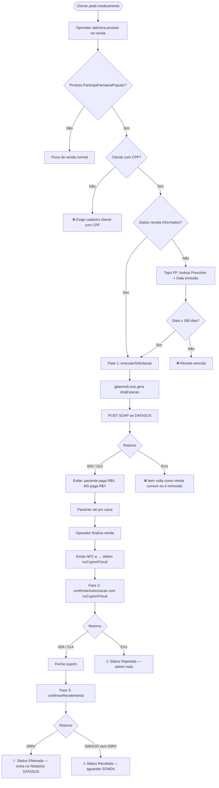
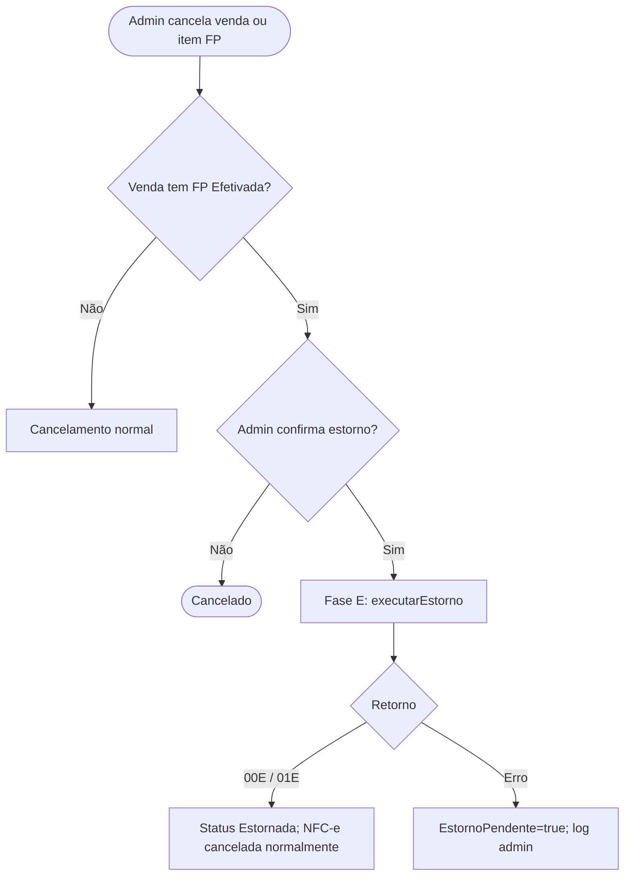
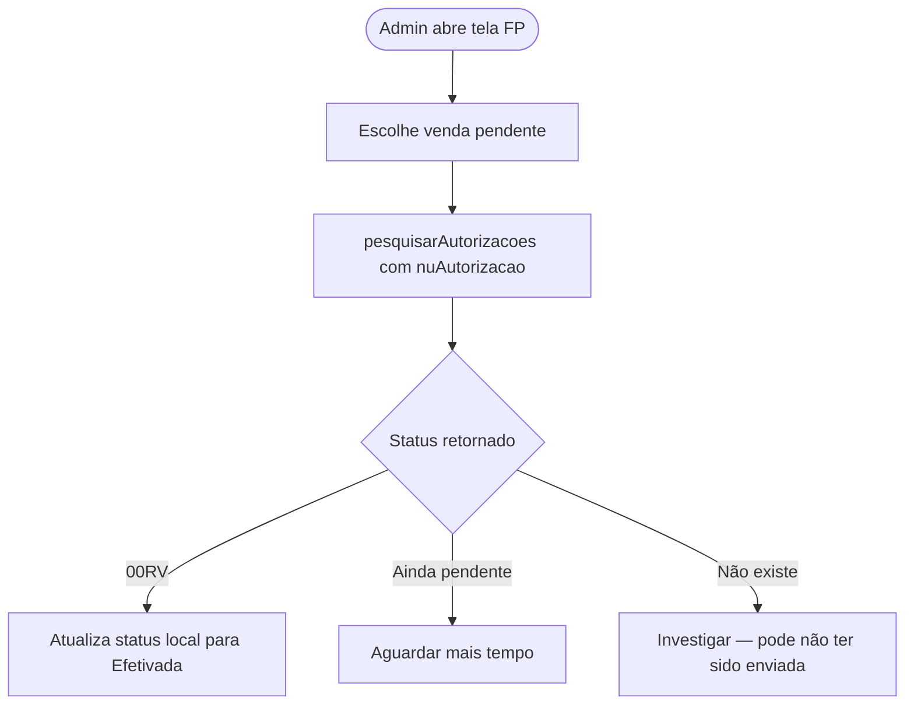

# Farmácia Popular (Aqui Tem Farmácia Popular / DATASUS) — Spec

**Status:** 🧪 Em revisão (ainda não implementado)
**Última atualização:** 2026-04-20 — @aalessandre
**Código alvo:** `backend/ZulexPharma.Infrastructure/Services/FarmaciaPopularService.cs` (a criar) · `frontend/src/app/modules/caixa-venda/` (hook)
**Depende de:** Venda · VendaItem · VendaFiscal (NFC-e) · CertificadosDigitais · Filial
**Help:** `/erp/help` → accordion **Farmácia Popular**
**Snapshot do portal DATASUS:** `C:\lixos\FP\` (versão V-4.3.1_RC15, abril/2026)

---

## 1. Objetivo de Negócio

Integrar o ERP com o programa **Aqui Tem Farmácia Popular** (Ministério da Saúde / DATASUS) para dispensar medicamentos subsidiados. O governo federal paga parte ou a totalidade do medicamento; a farmácia recebe o subsídio via **Relatório de Pagamento** mensal do DATASUS após cada venda ser **efetivada** (código `00RV`).

**Dores que resolve:**
- Farmácia precisa autorizar, confirmar e encerrar cada dispensação no Portal DATASUS — hoje via outro sistema ou manual.
- Sem integração, a farmácia perde receita (medicamentos dispensados fora do fluxo FP não são subsidiados).
- Fluxo de 3 fases + estorno obriga sincronização ERP ↔ DATASUS pra não perder venda.

**Quem usa:**
- **Atendente/balconista** — inicia pré-autorização (Fase 1) na hora de montar a venda.
- **Operador de caixa** — confirma (Fase 2) + recebe (Fase 3) ao emitir cupom.
- **Admin/financeiro** — consulta SONDA (reconciliar com Relatório DATASUS).

---

## 2. Escopo

**Inclui:**
- Integração SOAP manual com `ServicoSolicitacaoWS` (5 operações).
- Fluxo 3 fases + estorno + consulta.
- Geração de `dnaEstacao` via `gbasmsb.exe` (executável proprietário DATASUS).
- Configuração por filial (Portal FP credenciais + caminho do exe).
- Reaproveitamento do certificado A1 da NFC-e.
- Nova entidade `VendaFarmaciaPopular` (1:1 Venda) + `VendaFarmaciaPopularItem` (1:1 VendaItem dos itens FP).
- Flag `ParticipaFarmaciaPopular` no produto.
- Tela inline/modal de pré-autorização (balcão).
- Hook no caixa-venda pra Fase 2 + 3 na emissão do cupom.
- Estorno automático quando cancela venda que tinha FP.

**Não inclui:**
- Substituir cadastro oficial do estabelecimento no Portal DATASUS (externo).
- Leitura/parse do Relatório de Pagamento mensal do DATASUS (pode virar feature futura — conciliação financeira).
- Receita eletrônica / assinatura digital do médico — apenas capturamos CRM/UF/data.
- Reprocessamento automático de transações pendentes (SONDA manual por enquanto).
- Distribuir `gbasmsb.exe` em cada PDV — arquitetura centralizada no servidor.

---

## 3. Glossário

- **FP:** Aqui Tem Farmácia Popular (programa federal).
- **DATASUS:** Departamento de Informática do SUS — operador técnico.
- **SCTIE / DAF:** Secretaria de Ciência, Tecnologia e Insumos Estratégicos / Departamento de Assistência Farmacêutica (órgão responsável).
- **Pré-autorização (Fase 1):** DATASUS aprova a dispensação antes do caixa; retorna `nuAutorizacao`.
- **Confirmação (Fase 2):** no caixa, informa o número do cupom fiscal.
- **Recebimento (Fase 3):** fecha o ciclo após cupom emitido — venda só é **efetivada** (`00RV`) após essa fase.
- **Estorno:** devolve parcial ou total ao DATASUS quando o cliente cancela/devolve.
- **SONDA:** operação de consulta (`pesquisarAutorizacoes`) pra verificar status.
- **dnaEstacao:** hash único por transação, gerado pelo `gbasmsb.exe` do DATASUS.
- **nuAutorizacao:** número gerado pelo DATASUS na Fase 1, formato `998.467.862.438.252` — cola as 3 fases.
- **nuCupomFiscal:** número do cupom NFC-e — enviado na Fase 2 e Fase 3.
- **qtPrescrita:** posologia diária (ex: 2 comprimidos/dia). Para insulina, usar `1`.
- **qtSolicitada:** quantidade que a farmácia quer dispensar (ex: 60 comprimidos pra 30 dias).
- **qtAutorizada:** quantidade que o DATASUS aprovou (pode ser menor que solicitada).
- **vlPrecoSubsidiadoMS:** parte paga pelo governo.
- **vlPrecoSubsidiadoPaciente:** parte paga pelo paciente (co-pagamento).

---

## 4. Atores / Permissões

| Ator | Ações | Permissão |
|------|-------|-----------|
| Atendente/balconista | Inicia Fase 1 (pré-autorização) | `vendas:i` + acesso ao caixa |
| Operador de caixa | Fase 2 + 3 (automáticas na finalização) | `vendas:i` (implícito) |
| Admin | Configura credenciais Portal FP + caminho `gbasmsb.exe` por filial; consulta SONDA | `farmacia-popular:a` (nova) |

---

## 5. Regras de Negócio (invariantes)

- **RN-01 — Produto precisa flag FP:** só dispara fluxo FP se o produto tiver `ParticipaFarmaciaPopular = true`. Sem flag, item vai como venda comum.
- **RN-02 — Cliente obrigatório com CPF válido:** venda FP exige CPF do paciente. Venda sem cliente ou com CPF inválido → item não pode ser FP (cai em venda comum).
- **RN-03 — Receita obrigatória:** Prescritor selecionado (lookup obriga cadastro prévio — CRM/UF vêm dele) + data de emissão. Data não pode ser superior a **180 dias** (RN-BE-01 do DATASUS — validar localmente antes de enviar).
- **RN-04 — `dnaEstacao` por transação:** não pode ser cacheado. Cada execução do `executarSolicitacao` exige um `dnaEstacao` fresco gerado via `gbasmsb.exe`.
- **RN-05 — Estação centralizada:** MVP roda `gbasmsb.exe` apenas no **servidor Windows** do ERP (1 cadastro único no Portal FP). PDVs web não têm o executável. Se DATASUS rejeitar por hardware divergente, revisar arquitetura.
- **RN-06 — 3 fases obrigatórias e sequenciais:** não pode pular. Fase 3 só depois de Fase 2, que só depois de Fase 1. Fase 2 precisa de `nuCupomFiscal` (vindo da NFC-e).
- **RN-07 — `nuCupomFiscal` = número NFC-e:** único campo de ligação entre a venda e o registro DATASUS. Usar `VendaFiscal.Numero` (NFC-e mod 65 autorizada).
- **RN-08 — Venda só é efetivada após `00RV`:** se Fase 3 não retornar `00RV`, o registro do DATASUS fica pendente → precisa SONDA/retry. A venda no ERP continua finalizada (NFC-e autorizada), mas a FP não conta no Relatório de Pagamento.
- **RN-09 — Estorno segue o cancelamento:** ao cancelar venda FP (ou devolver item FP), disparar `executarEstorno` automaticamente. Se DATASUS rejeitar o estorno, logar erro + flag `EstornoPendente=true` pra admin tratar manual.
- **RN-10 — Item FP + item comum na mesma venda:** permitido. O mesmo cupom NFC-e cobre os dois. O DATASUS só enxerga os itens FP (enviados na Fase 1/3).
- **RN-11 — NFC-e emitida entre Fase 2 e Fase 3:** o operador precisa ter o `nuCupomFiscal` pra mandar na Fase 2. Fluxo: emite NFC-e → recebe número → Fase 2 → Fase 3. Se NFC-e falhar, não pode confirmar — venda FP fica pendente.
- **RN-12 — Credenciais Portal FP ≠ Credenciais ERP:** `loginFarmacia/senhaFarmacia` + `loginVendedor/senhaVendedor` são do cadastro externo no Portal DATASUS, não são usuários do ERP. Vão embutidas em cada chamada SOAP.
- **RN-13 — MVP com 1 vendedor por filial:** `loginVendedor/senhaVendedor` é único por filial (`FarmaciaPopularConfig`). Futuro: pode virar por colaborador se DATASUS pedir auditoria por operador.
- **RN-14 — XMLs req/resp persistidos:** cada fase grava request + response completos na `VendaFarmaciaPopular` pra auditoria/retentativa.
- **RN-15 — Preço e subsídio vêm do DATASUS:** `vlPrecoSubsidiadoMS` e `vlPrecoSubsidiadoPaciente` são calculados pelo DATASUS (Fase 1). ERP **não cadastra** esses valores — só os exibe ao operador. O `vlPrecoVenda` que enviamos é o `PrecoFp` do cadastro do produto (ou `PrecoFpBolsaFamilia` se o paciente for Bolsa Família), **não** o preço normal de venda livre.
- **RN-16 — Cadastro FP do produto obrigatório:** se `Produto.ParticipaFarmaciaPopular=true`, os 3 campos FP (`QtdeEmbalagem`, `PrecoFp`, `PrecoFpBolsaFamilia`) são **obrigatórios**. Validação ao salvar produto + ao montar venda FP.
- **RN-17 — Conversão de comprimidos ↔ embalagens:** `QtdeEmbalagem` define quantos comprimidos/ml vêm em cada caixa. Se o paciente precisa de 60 comprimidos (30 dias × 2/dia) e a embalagem tem 30 comprimidos, a venda dispensa 2 embalagens. O `qtSolicitada` enviado ao DATASUS é sempre em **unidades-base** (comprimidos/ml), não em embalagens. O preço enviado (`vlPrecoVenda`) escala proporcionalmente quando necessário.
- **RN-18 — Bolsa Família é escolhido na venda:** a aba FP tem um **checkbox "Bolsa Família"** (default desmarcado). Se marcado, o sistema usa `PrecoFpBolsaFamilia` em vez de `PrecoFp`. Não há flag no cliente — é decisão do operador a cada atendimento, baseado em documento apresentado pelo paciente. O valor do checkbox é persistido em `VendaFarmaciaPopular.BolsaFamilia` (bool) pra auditoria.
- **RN-19 — Credenciais do vendedor vêm do Colaborador:** o **usuário** no Portal FP é sempre o **CPF do colaborador** (sem pontuação). A **senha** é cadastrada em `Colaborador.SenhaFarmaciaPopularCripto` (AES-256), editada na tela de colaboradores ("seção Farmácia Popular"). Não há credenciais de vendedor em `Configurações` — lá só ficam as credenciais da **farmácia** (estabelecimento). Isso permite auditoria por colaborador e lida com múltiplos operadores.
- **RN-20 — CRM via lookup de Prescritor:** o campo "CRM" na aba FP é um **lookup pesquisável** sobre a tabela `Prescritor` (mesma usada pelo SNGPC). Operador digita nome ou nº do conselho, sistema traz {tipo, número, UF, nome}. Se o prescritor não existir, o operador precisa cadastrá-lo antes na tela Prescritores (não inventamos médico na hora — receita FP exige dados validados). Os campos `CrmMedico` e `UfCrm` persistidos em `VendaFarmaciaPopular` são snapshot do prescritor no momento da venda.

---

## 6. Modelo de Dados

### Decisão arquitetural (confirmada com o usuário)

**Reusar TODAS as tabelas existentes de venda.** A venda FP é uma venda normal do ERP — com itens, totais, pagamentos, caixa, cupom fiscal. Só ganha dados extras do ciclo DATASUS em tabelas-satélite 1:1.

| Tabela existente | Papel na venda FP |
|------------------|-------------------|
| `Venda` | Cabeçalho da venda (cliente, filial, caixa, totais, status) — **sem alteração** |
| `VendaItem` | Itens vendidos (produto, qtd, preço) — **sem alteração** |
| `VendaFiscal` | Registro NFC-e (chave, número, protocolo) — `VendaFiscal.Numero` = `nuCupomFiscal` da Fase 2/3 |
| `VendaItemFiscal` | Dados fiscais por item (CFOP, CST, ICMS, etc.) — **sem alteração** |

**Tabelas NOVAS** (só dados específicos do ciclo DATASUS):

- `VendaFarmaciaPopular` (1:1 `Venda`) — cabeçalho FP: autorização, solicitação, CRM, CPF, XMLs, status das fases
- `VendaFarmaciaPopularItem` (1:1 `VendaItem`) — dados FP por item: qtPrescrita, qtAutorizada, subsídios MS/paciente, códigos de retorno

**Vantagens dessa abordagem:**
- ✅ Nenhuma duplicação de total, estoque, caixa, fiscal
- ✅ Nenhuma FK nova em `Venda`/`VendaItem`/`VendaFiscal`/`VendaItemFiscal` (ficam intactas)
- ✅ `VendaFarmaciaPopular` é **opcional** — só existe pras vendas que tiveram item FP
- ✅ Relatórios comuns de venda (produtividade, fiscal, caixa) funcionam naturalmente
- ✅ Migração futura (desabilitar FP, migrar pra outro sistema) não toca a venda — só dropa as 2 tabelas satélite

**Ligação entre as tabelas (fluxo completo):**

```
Venda ────────────── 1:1 ──── VendaFarmaciaPopular
  │
  ├─ VendaItem ────── 1:1 ──── VendaFarmaciaPopularItem (opcional, só pros itens FP)
  │
  └─ VendaFiscal ──── provê nuCupomFiscal p/ Fases 2 e 3
       │
       └─ VendaItemFiscal (1:1 VendaItem) — dados fiscais intactos
```

### Configuração — chaves em `Configuracoes` (tabela key-value existente)

**Decisão:** não criar tabela `FarmaciaPopularConfig`. Usa o padrão key-value já consolidado (`fiscal.ambiente`, `fiscal.nfce.csc`, etc.). Prefixo: `pbm.fp.*`.

| Chave | Tipo | Default | Descrição |
|-------|------|---------|-----------|
| `pbm.fp.ativar` | bool (`true`/`false`) | `false` | Liga/desliga o fluxo FP. Se false, produtos com flag FP caem em venda comum sem disparar DATASUS |
| `pbm.fp.plano.conta.id` | long | — | Plano de contas pra lançar o subsídio recebido do MS (Relatório DATASUS) |
| `pbm.fp.cnpj` | string | — | CNPJ cadastrado no Portal FP (pode diferir do CNPJ da filial se for matriz) |
| `pbm.fp.usuario.farmacia` | string | — | Credencial Portal FP — login do estabelecimento |
| `pbm.fp.senha.farmacia` | string (encriptada) | — | AES mesma chave do projeto |
| ~~`pbm.fp.usuario.vendedor`~~ | ~~string~~ | ~~—~~ | **Removido** — credenciais do vendedor agora vêm do Colaborador (ver RN-19) |
| ~~`pbm.fp.senha.vendedor`~~ | ~~string~~ | ~~—~~ | **Removido** |
| `pbm.fp.ambiente` | string (`producao`/`homologacao`) | `homologacao` | Define URL do WSDL a usar |
| `pbm.fp.pagar.comissao` | bool | `false` | Se true, item FP entra no cálculo de comissão do vendedor (regra de negócio) |
| `pbm.fp.cadastro.interno.cliente.id` | long | — | Cliente "fantasma" pra lançar a parte do MS no caixa (contrapartida financeira do recebimento DATASUS) |
| `pbm.fp.caminho.gbasmsb` | string | — | Ex: `C:\ErpPharma\FP\gbasmsb.exe` (não fica na tela, configuração de infra) |
| `pbm.fp.url.producao` | string | URL oficial | Normalmente fixo, exposto pra casos de mudança do endpoint |
| `pbm.fp.url.homologacao` | string | URL sandbox | Idem |
| `pbm.fp.ultimo.teste.data` | DateTime? | — | Log do "Testar Conexão" |
| `pbm.fp.ultimo.teste.mensagem` | string? | — | |

**Notas:**
- Senhas são encriptadas via AES (mesma chave/padrão de outras credenciais do projeto — certificado, sistemaKey).
- Configurações por filial seguem o padrão atual do ERP: **globais hoje** (não granular por filial). Se no futuro precisar FP por filial, migrar pra tabela `FiliaisConfiguracoes` ou similar.
- URLs oficiais:
  - Produção: `https://farmaciapopular-autorizador.saude.gov.br/...`
  - Homologação: a confirmar com DATASUS (pode não haver sandbox público).

### Entidade `VendaFarmaciaPopular` (nova — 1:1 com Venda)

| Campo | Tipo | Obrig. | Descrição |
|-------|------|--------|-----------|
| `Id` | long | auto | |
| `VendaId` | long (FK unique) | ✅ | |
| `CoSolicitacaoFarmacia` | string (unique) | ✅ | Gerado pelo PDV, formato sugerido `{filialId}-{vendaId}-{timestamp}` |
| `NuAutorizacao` | string? | — | Retorno Fase 1 (formato `998.467.862.438.252`) |
| `NuCupomFiscal` | string? | — | = `VendaFiscal.Numero` (copiado ao emitir NFC-e) |
| `DnaEstacao` | string? | — | Saída do `gbasmsb.exe` na Fase 1 |
| `CnpjEstabelecimento` | string(14) | ✅ | Copiado da filial no momento da Fase 1 (snapshot) |
| `CpfPaciente` | string(11) | ✅ | |
| `NoPaciente` | string? | — | Retorno Fase 1 (validação visual) |
| `BolsaFamilia` | bool | ✅ | Default false; true usa `PrecoFpBolsaFamilia` do produto |
| `CrmMedico` | string | ✅ | |
| `UfCrm` | string(2) | ✅ | |
| `DtEmissaoReceita` | DateOnly | ✅ | Validar ≤ 180 dias |
| `NuReceita` | string? | — | Opcional (nº da receita em papel, se informado pelo operador) |
| `PrescritorId` | long (FK) | ✅ | **Obrigatório** — referência à tabela `Prescritor` (lookup na aba FP). `CrmMedico` e `UfCrm` são snapshot (redundância auditável) |
| `Status` | enum `StatusFarmaciaPopular` | ✅ | Ver enum abaixo |
| `FaseAtual` | enum `FaseFarmaciaPopular` | ✅ | |
| `CodigoRetornoAtual` | string? | — | Ex: `00S`, `00A`, `00RV` |
| `MensagemRetornoAtual` | string? | — | Mensagem descritiva |
| `EstornoPendente` | bool | ✅ | Default false — true se Fase E não concluiu |
| `Fase1RequestXml` / `Fase1ResponseXml` / `Fase1DataHora` | string / string / DateTime? | — | Auditoria |
| `Fase2RequestXml` / `Fase2ResponseXml` / `Fase2DataHora` | string / string / DateTime? | — | |
| `Fase3RequestXml` / `Fase3ResponseXml` / `Fase3DataHora` | string / string / DateTime? | — | |
| `EstornoRequestXml` / `EstornoResponseXml` / `EstornoDataHora` | string / string / DateTime? | — | |
| `Ativo` | bool | ✅ | |

### Entidade `VendaFarmaciaPopularItem` (nova — 1:1 com VendaItem)

| Campo | Tipo | Obrig. | Descrição |
|-------|------|--------|-----------|
| `Id` | long | auto | |
| `VendaFarmaciaPopularId` | long (FK) | ✅ | Cabeçalho |
| `VendaItemId` | long (FK unique) | ✅ | |
| `CodigoBarraEAN` | string | ✅ | Snapshot do EAN enviado |
| `QtPrescrita` | decimal | ✅ | Posologia diária (insulina=1) |
| `QtSolicitada` | decimal | ✅ | = VendaItem.Quantidade (snapshot no momento da Fase 1) |
| `QtAutorizada` | decimal? | — | Retorno Fase 1 |
| `QtDispensada` | decimal? | — | Efetivamente enviado na Fase 3 (normalmente = QtAutorizada) |
| `QtEstornada` | decimal? | — | Retorno Estorno (confirmado pelo DATASUS) |
| `VlPrecoVenda` | decimal | ✅ | Preço normal do produto (snapshot) |
| `VlPrecoSubsidiadoMS` | decimal? | — | Retorno DATASUS — governo paga |
| `VlPrecoSubsidiadoPaciente` | decimal? | — | Retorno DATASUS — paciente paga |
| `CodigoRetornoItem` | string? | — | Ex: `00SM` (autorizado) |
| `MensagemRetornoItem` | string? | — | |
| `InAutorizacaoMedicamento` | string? | — | Código específico do retorno |

### Alteração em `Produto`

Já existiam: `QtdeEmbalagem` (int, default 1) e `PrecoFp` (decimal?). Apenas 2 campos novos:

| Campo | Tipo | Default | Descrição |
|-------|------|---------|-----------|
| `ParticipaFarmaciaPopular` | bool | false | **NOVO** — ativa fluxo FP pra esse produto |
| `PrecoFpBolsaFamilia` | decimal? | — | **NOVO** — preço tabela FP reduzido pra Bolsa Família |

Os 4 campos juntos definem o produto pra FP:
- `QtdeEmbalagem` — comprimidos/ml por embalagem (já existia, global pro ERP)
- `PrecoFp` — preço tabela normal (já existia)
- `PrecoFpBolsaFamilia` — preço tabela reduzido (novo)
- `ParticipaFarmaciaPopular` — ativa fluxo (novo)

**Validação:** se `ParticipaFarmaciaPopular=true`, `QtdeEmbalagem > 0` + `PrecoFp` e `PrecoFpBolsaFamilia` são obrigatórios.

### Alteração em `Colaborador`

| Campo | Tipo | Default | Descrição |
|-------|------|---------|-----------|
| `SenhaFarmaciaPopularCripto` | string? | null | **NOVO** — senha do colaborador no portal DATASUS Farmácia Popular, AES-256. |

- O **usuário** no portal FP é sempre o CPF do colaborador, armazenado em `Pessoa.CpfCnpj` (só dígitos). Não há campo duplicado.
- Na tela de colaboradores, bloco "Farmácia Popular" mostra:
  - **Usuário (CPF)** — readonly, deriva de `Pessoa.CpfCnpj`.
  - **Senha Farmácia Popular** — input password, criptografada ao salvar (helper `CriptografiaHelper.Encrypt`).
- Decriptada apenas no momento do uso (hora da venda FP, passada pro SOAP).

### Enums novos

```csharp
public enum StatusFarmaciaPopular
{
    Iniciada = 1,              // coSolicitacaoFarmacia gerado, ainda não enviou Fase 1
    PreAutorizada = 2,         // 00S retornado
    PreAutorizadaParcial = 3,  // 01S
    Confirmada = 4,            // 00A
    ConfirmadaParcial = 5,     // 01A
    Recebida = 6,              // 00R (intermediário)
    Efetivada = 7,             // 00RV — sucesso final
    Estornada = 8,             // 00E
    EstornadaParcial = 9,      // 01E
    Rejeitada = 10,            // qualquer código de erro numa das fases
    Erro = 11                  // timeout / falha de rede / erro interno
}

public enum FaseFarmaciaPopular
{
    Solicitacao = 1,   // Fase 1 (executarSolicitacao)
    Confirmacao = 2,   // Fase 2 (confirmarAutorizacao)
    Recebimento = 3,   // Fase 3 (confirmarRecebimento)
    Concluida = 4,     // 00RV alcançado
    Estornada = 5      // ciclo encerrado por estorno
}
```

### Relacionamentos

- `Venda 1—1 VendaFarmaciaPopular` (opcional — só existe se a venda tem item FP)
- `VendaFarmaciaPopular 1—N VendaFarmaciaPopularItem`
- `VendaItem 1—1 VendaFarmaciaPopularItem` (opcional — só pros itens FP)
- `VendaFarmaciaPopular N—1 Prescritor?` (opcional, se conseguir match por CRM+UF na tabela Prescritor do SNGPC)
- Configurações FP ficam em `Configuracoes` (chaves `pbm.fp.*`)

---

## 7. Fluxos

### Fluxo 1 — Venda com item FP (caminho feliz)



### Fluxo 2 — Estorno (cancelamento de venda FP)



### Fluxo 3 — SONDA (consulta manual)



---

## 8. Contratos de API

### Endpoints do ERP (novos)

| Verbo | Rota | Request | Response |
|-------|------|---------|----------|
| GET | `/api/farmacia-popular/config/{filialId}` | — | `FarmaciaPopularConfigDto` |
| PUT | `/api/farmacia-popular/config/{filialId}` | `FarmaciaPopularConfigFormDto` | 200 |
| POST | `/api/farmacia-popular/testar-conexao?filialId=X` | — | `{ sucesso, mensagem, ultimoTeste }` |
| POST | `/api/farmacia-popular/vendas/{vendaId}/solicitar` | `{ cpf, crm, ufCrm, dtEmissao, nuReceita?, itens: [{vendaItemId, qtPrescrita}] }` | `AutorizacaoDto` (Fase 1) |
| POST | `/api/farmacia-popular/vendas/{vendaId}/confirmar` | — (usa NFC-e já emitida) | `ConfirmacaoDto` (Fase 2) |
| POST | `/api/farmacia-popular/vendas/{vendaId}/receber` | — | `RecebimentoDto` (Fase 3) |
| POST | `/api/farmacia-popular/vendas/{vendaId}/estornar` | `{ itens: [{vendaItemId, qtDevolvida}] }` | `EstornoDto` |
| GET | `/api/farmacia-popular/vendas/{vendaId}/sonda` | — | Status atualizado do DATASUS |
| GET | `/api/farmacia-popular/pendentes?filialId=X` | — | Lista de vendas com `Status ≠ Efetivada` |

### WSDL externo (DATASUS)

5 operações — todas recebem `(DTO in0, UsuarioFarmaciaDTO in1)`:
- `executarSolicitacao` → Fase 1
- `confirmarAutorizacao` → Fase 2
- `confirmarRecebimento` → Fase 3
- `executarEstorno` → Estorno
- `pesquisarAutorizacoes` → SONDA

Endpoint produção: `https://farmaciapopular-autorizador.saude.gov.br/farmaciapopular-autorizador/services/ServicoSolicitacaoWS`

---

## 9. Validações

| Campo | Regra | Erro |
|-------|-------|------|
| `CpfPaciente` | 11 dígitos + DV válido | "CPF inválido" |
| `CrmMedico` | Não vazio | "CRM obrigatório" |
| `UfCrm` | 2 letras | "UF inválida" |
| `DtEmissaoReceita` | Entre (hoje-180d) e hoje | "Receita vencida" (se >180d) |
| `QtPrescrita` | > 0 | "Posologia inválida" |
| `QtSolicitada` | > 0 e ≤ QtPrescrita × Dias máximo | "Quantidade acima do permitido" |

---

## 10. Integrações Externas

### DATASUS / Portal Farmácia Popular
- **Protocolo:** SOAP 1.1 **RPC/encoded** (Apache Axis 1.4 — legado Java)
- **WCF .NET NÃO suporta bem** — envelope montado manualmente via `HttpClient`
- **Autenticação:** credenciais embutidas em cada chamada (`UsuarioFarmaciaDTO`)
- **Certificado:** A1 reaproveitado da NFC-e (`CertificadosDigitais`)
- **HTTPS com client cert:** a confirmar em testes — talvez mTLS

### gbasmsb.exe (módulo de segurança)
- Executável Windows x86 proprietário do DATASUS
- Baixado do Portal FP (seção módulo de segurança)
- Chamada: `gbasmsb.exe --solicitacao CPF CNPJ CRM UF DTEMISSAO RECEITA`
- Saída stdout = `dnaEstacao`
- Gera hash + fingerprint do hardware → **não pode ser cacheado** por transação
- MVP: roda no servidor Windows (1 estação cadastrada no Portal FP); PDVs web não precisam do exe local
- **Risco:** se DATASUS validar fingerprint por PDV, arquitetura centralizada quebra → revisitar

---

## 11. UI — Estrutura

### Tela — Configurações → accordion "PBMs" → seção "Farmácia Popular"

Reuso do padrão key-value existente (tela `/erp/configuracoes`). Novo accordion **"PBMs"** (container para Farmácia Popular e, no futuro, outros convênios tipo Trodat/Pague Menos PBM, EPharma, etc.). Dentro dele, seção **"Farmácia Popular"** com os campos abaixo.

**Campos (mapeados pras chaves de §6):**

| Label na UI | Chave | Tipo UI |
|-------------|-------|---------|
| **Ativar** | `pbm.fp.ativar` | Toggle |
| **Plano de Contas** | `pbm.fp.plano.conta.id` | Dropdown/lookup de `PlanoContas` |
| **CNPJ cadastrado no FP** | `pbm.fp.cnpj` | Input com máscara CNPJ |
| **Usuário (Farmácia)** | `pbm.fp.usuario.farmacia` | Input texto |
| **Senha (Farmácia)** | `pbm.fp.senha.farmacia` | Input password |
| **Ambiente** | `pbm.fp.ambiente` | Dropdown: Homologação \| Produção |
| **Pagar comissão** | `pbm.fp.pagar.comissao` | Toggle |
| **Cadastro Interno FP (cliente)** | `pbm.fp.cadastro.interno.cliente.id` | Lookup/autocomplete de cliente |

> **Credenciais do vendedor** NÃO ficam aqui. São cadastradas **por colaborador** na tela **Colaboradores > seção "Farmácia Popular"**: usuário = CPF (readonly), senha = `Colaborador.SenhaFarmaciaPopularCripto` (AES-256). Veja RN-19.

**Fora da tela** (configurações de infra — ficam em `appsettings.json` ou chaves não exibidas):
- `pbm.fp.caminho.gbasmsb` — caminho do executável no servidor
- `pbm.fp.url.producao` / `pbm.fp.url.homologacao` — endpoints (pode mudar raramente, mas não exposto na UI)

**Ação:** Botão **"Testar Conexão"** → chama backend `POST /api/farmacia-popular/testar-conexao` que invoca `pesquisarAutorizacoes` com parâmetros dummy + atualiza `pbm.fp.ultimo.teste.*`.

### Mega menu "PBMs" no rodapé de pre-venda/venda-caixa

Ao lado do mega menu "Opções" existente, **novo mega menu "PBMs"** com tiles pra cada convênio/programa suportado:

- **Farmácia Popular** (foco desta spec)
- **E-Pharma** (futuro)
- **Funcional Card** (futuro)
- **Vidalink** (futuro)

Comportamento: clicar num PBM **abre uma nova aba de venda dedicada** a esse PBM (ex: "Atendimento 2 — Farmácia Popular"). A aba comum de venda livre fica preservada. Cada PBM tem seu fluxo próprio (itens, regras, UI específica).

### Aba de venda "Farmácia Popular" (nova)

Tela derivada do caixa-venda/pre-venda, com customizações:

**Topo — campos extras obrigatórios (mostrados antes dos produtos):**
- Cliente com CPF (obrigatório, trava se não tiver)
- CRM + UF + Data de emissão da receita (trava se vazio ou > 180 dias)
- Nº Receita (opcional)
- **Checkbox "Bolsa Família"** (default desmarcado) — ao marcar, preços dos itens já mostrados no grid recalculam pro `PrecoFpBolsaFamilia`

**Grid de itens — coluna adicional "Qtde/dia"** (editável, obrigatória):
- É a **posologia diária** do paciente (`qtPrescrita` no DATASUS)
- Ex: Losartana 50mg, 2 comprimidos/dia → `Qtde/dia = 2`
- Para **insulina/líquidos** vai sempre `1` (por ml já prescrito)
- Sem esse valor preenchido, não dispara Fase 1

**Preço exibido:** o grid mostra `PrecoFp` (ou `PrecoFpBolsaFamilia` conforme cliente) em vez do preço de venda livre. Coluna extra **"Subsídio MS / Paciente"** (preenchida após Fase 1) mostra o breakdown.

**Fluxo do botão "Pré-autorizar" (disparado manualmente após preencher tudo):**

1. Sistema valida: cliente com CPF + receita preenchida + todos itens com Qtde/dia + Produto.ParticipaFarmaciaPopular em todos.
2. Gera `coSolicitacaoFarmacia` único.
3. Invoca `gbasmsb.exe` no servidor → recebe `dnaEstacao`.
4. Monta `SolicitacaoDTO` com itens convertidos (qtSolicitada em unidades-base).
5. Chama `executarSolicitacao` no DATASUS.
6. Retorno:
   - **00S/01S** → cada item exibe **badge "Autorizado"** + preenche colunas `qtAutorizada`, `subsídio MS`, `subsídio Paciente`. Libera botão "Finalizar".
   - **Rejeitada** → modal mostra mensagem DATASUS. Operador pode ajustar e tentar de novo ou cancelar.

**Finalizar venda FP:**
- Mesmo fluxo da venda comum (emite NFC-e) + hooks de Fase 2 e Fase 3.
- Se NFC-e falhar → Fase 2/3 não disparam → `VendaFarmaciaPopular.Status` fica em `PreAutorizada` → admin trata via SONDA.
- Se Fase 2/3 falharem → NFC-e já foi emitida, venda já foi finalizada — aparece no Gerenciador FP como pendente.

### Caixa → Gerenciador FP (nova tela, dentro do Caixa como painel GE-like)
- Lista de vendas com Status ≠ Efetivada (últimos 30 dias)
- Ações por status:
  - `Rejeitada` → ver detalhes + resubmeter
  - `Recebida` (sem 00RV) → botão SONDA
  - `EstornoPendente=true` → botão "Retentar Estorno"
- Detalhes expandem mostrando Fase1/2/3/E com XMLs req/resp

---

## 12. Efeitos Colaterais

- **Venda cancelada que tinha FP Efetivada** → dispara estorno automático. Se estorno der erro, `EstornoPendente=true` e admin trata.
- **NFC-e cancelada** → idem. NFC-e pode ser cancelada pelo cupom, mas o estorno FP precisa ser independente.
- **Produto perde flag FP** → vendas passadas permanecem intactas; novas vendas vão como comuns.
- **Filial desabilita FP (`Habilitado=false`)** → novas vendas não disparam fluxo. Vendas pendentes continuam exibidas pra tratamento manual.
- **Fase 1 OK + NFC-e falha** → FP fica órfã. Status `PreAutorizada` indefinidamente. Admin pode SONDAR ou marcar manualmente como `Rejeitada` pra limpar.

---

## 13. Critérios de Aceite

- [ ] Cadastrar `FarmaciaPopularConfig` completa por filial.
- [ ] Clicar "Testar Conexão" → retorna sucesso ou mensagem de erro clara.
- [ ] Marcar produto como `ParticipaFarmaciaPopular` → flag persiste.
- [ ] Adicionar produto FP em venda sem cliente → modal bloqueia.
- [ ] Adicionar produto FP em venda com cliente sem CPF → modal bloqueia.
- [ ] Adicionar produto FP → modal de receita aparece → validar 180 dias.
- [ ] Fase 1 retorna 00S → item fica com badge FP + breakdown de preço.
- [ ] Fase 1 retorna erro → item vira venda comum (ou é removido, conforme escolha do operador).
- [ ] Emitir NFC-e → Fase 2 dispara automática com `nuCupomFiscal`.
- [ ] Fase 2 retorna 00A → Fase 3 dispara.
- [ ] Fase 3 retorna 00RV → status `Efetivada`.
- [ ] Cancelar venda FP efetivada → estorno dispara automaticamente → status `Estornada` após 00E.
- [ ] Estorno falha → `EstornoPendente=true` + log.
- [ ] Tela Gerenciador FP lista pendentes; SONDA atualiza status.
- [ ] Venda com item FP + item comum → NFC-e emite os dois; DATASUS só recebe os FP.
- [ ] XMLs req/resp de cada fase persistidos em `VendaFarmaciaPopular`.
- [ ] Receita com data > 180 dias → erro local antes de chamar DATASUS.

---

## 14. Decisões & Tradeoffs

- **Reuso de Venda/VendaItem:** a escolha desta spec (em vez de `FarmaciaPopularTransacao` paralela). Evita duplicar total, cliente, estoque, caixa. FP vira um "apêndice" da venda. Tradeoff: 2 tabelas satélite a mais, mas nullable na VendaItem evita poluição.
- **`gbasmsb.exe` no servidor:** 1 cadastro no Portal FP, simples de deployar. Tradeoff: se DATASUS validar fingerprint por PDV, refatorar. Decisão: validar em testes de homologação primeiro.
- **SOAP manual em vez de WCF:** WCF não casa bem com Axis 1.4 RPC/encoded. Tradeoff: mais código (XDocument/StringBuilder), mas controle total. Já temos padrão com NFC-e (que também é manual).
- **MVP 1 vendedor por filial:** simplifica config. Futuro: tabela `FarmaciaPopularCredencialColaborador` se DATASUS pedir auditoria por operador.
- **Status + FaseAtual redundantes:** `Status` expressa o estado do ciclo; `FaseAtual` a fase em progresso. Pode parecer duplicação mas facilita queries ("quais estão na Fase 3?" vs "quais efetivadas?").
- **XML req/resp em `text`:** overhead de espaço mas indispensável pra auditoria + retentativa + debug de rejeições DATASUS.
- **Sem retentativa automática:** Fase 1/2/3 rodam uma vez cada; falha fica pra admin tratar via SONDA ou retentativa manual. Tradeoff: menos código + menos risco de duplicar autorização. Retry automático pode vir numa fase futura.
- **Aba dedicada por PBM em vez de hook na venda comum:** quando clica em "Farmácia Popular" no mega menu PBMs, abre uma aba **separada** pra esse fluxo (operador não mistura item FP com item comum na mesma aba). Tradeoff: mais código (aba nova) mas:
  - Fluxo mais limpo pro operador — sabe exatamente que está numa "venda FP"
  - Regras de validação FP (receita, CPF, Qtde/dia) ficam localizadas
  - Futuros PBMs (E-Pharma, Vidalink) reusam o mesmo padrão de "aba dedicada"
  - **Não** impede misturar itens: se o paciente quer levar FP + um shampoo, faz em 2 atendimentos (ou num futuro, a aba FP aceita itens não-FP também, mas com regra clara de "este item não é subsidiado").
- **Preço enviado ao DATASUS é `PrecoFp` (não o preço livre):** o governo divulga valores de tabela pros produtos FP. O `vlPrecoVenda` no SOAP é esse valor de tabela. O ERP só cadastra uma vez e usa em toda venda FP. Tradeoff: cadastro duplicado (preço livre + FP + FP-BolsaFamilia) mas permite ajustar sem afetar vendas comuns.

---

## 15. Migração de Dados

Não há dados legados de FP no ERP (integração nova). Migration:
1. Cria `FarmaciaPopularConfigs`, `VendaFarmaciaPopulares`, `VendaFarmaciaPopularItens`.
2. Adiciona `Produto.ParticipaFarmaciaPopular` (default false).
3. Inserts defensivos de `FarmaciaPopularConfig` vazio (`Habilitado=false`) pra cada filial — evita null checks.
4. Sem migração de transações antigas.

---

## 16. Perguntas em Aberto (resolver antes de implementar)

1. **Certificado A1 — mTLS?** Endpoint DATASUS exige client cert ou só HTTPS normal? Testar no ambiente de homologação antes de codar.
2. **Flag `ParticipaFarmaciaPopular` no Produto:** já existe? Se sim (talvez em `ProdutoDados` ou `ProdutoFiscal`), reaproveitar em vez de criar nova coluna.
3. **Preço subsidiado vem só no retorno?** Confirmado — ERP não cadastra. Mas queremos **cachear** o último retorno pra pré-visualizar ao operador antes da Fase 1? Decisão: MVP sem cache, sempre chama DATASUS.
4. **`gbasmsb.exe` aceita múltiplos CNPJs por estação?** Se a farmácia tem várias filiais no mesmo servidor ERP, a estação cadastrada é única — dá pra usar pra todas? Testar.
5. **Co-pagamento na venda:** quando DATASUS retorna `vlPrecoSubsidiadoPaciente > 0`, o cliente paga esse valor **em vez de** `vlPrecoVenda`? Representação: `VendaItem.PrecoVenda = vlPrecoVenda` (normal) + `VendaItem.ValorDesconto = vlPrecoVenda - vlPrecoSubsidiadoPaciente` (desconto FP). Assim TotalLiquido = soma dos valores pagos pelo cliente. A parte do MS **não entra no TotalLiquido** — farmácia recebe via Relatório de Pagamento separado. Validar se essa representação está OK pra contábil/caixa.
6. **Homologação DATASUS:** existe sandbox/homologação pública? Caso não exista, testes em produção com valores baixos.
7. **gbasmsb.exe 32-bit:** servidor Windows precisa rodar processo x86. `Process.Start` não é problema, mas garantir que o exe está no caminho configurado.
8. **Campos FP no Produto — global ou por filial?** Se o mesmo medicamento tem preços FP diferentes em filiais diferentes (improvável, preço tabela é federal), ficar em `Produto`. Se varia, migrar pra `ProdutoDados` (que já é por filial). **Decisão: ficar em `Produto`** até surgir caso real de divergência.
9. **Bolsa Família — onde marcar?** ✅ **Resolvido:** checkbox na aba FP (RN-18). Não vai no cliente — é decisão por atendimento.
10. **Misto FP + não-FP na mesma aba:** MVP **não permite** — aba FP só aceita produtos com flag FP. Se operador escanear produto sem flag, sistema avisa "Este produto não participa do Farmácia Popular. Remova ou atenda em outra aba."
11. **Mega menu PBMs — componente compartilhado:** o mega menu "PBMs" fica ao lado do "Opções" tanto em pre-venda quanto caixa-venda. Vale criar componente compartilhado `<app-mega-menu-pbms>` ou duplicar por simplicidade? Decisão: **componente compartilhado** pra manter lista de PBMs num lugar só.

---

## 17. Plano de Implementação (Fases)

### Fase 1 — Infra + Config + Cadastro (2-3 dias)
- Entidades Domain: `VendaFarmaciaPopular`, `VendaFarmaciaPopularItem` (config fica em `Configuracoes`).
- Enums `StatusFarmaciaPopular` + `FaseFarmaciaPopular`.
- Migration:
  - `Produto.ParticipaFarmaciaPopular` (bool default false)
  - `Produto.QtdeEmbalagem` (int nullable)
  - `Produto.PrecoFp` (decimal nullable)
  - `Produto.PrecoFpBolsaFamilia` (decimal nullable)
- Seed das chaves `pbm.fp.*` em `Configuracoes` com defaults seguros (ativar=false, ambiente=homologacao).
- Accordion **"PBMs" → seção "Farmácia Popular"** na tela de Configurações (key-value padrão).
- Atualizar cadastro de Produto: nova seção "Farmácia Popular" com 4 campos (toggle + embalagem + 2 preços), validação.
- Endpoint **`POST /api/farmacia-popular/testar-conexao`** (chama `pesquisarAutorizacoes` com CPF dummy).
- **✅ Validado:** geração de `dnaEstacao` via `gbasmsb.exe` (testes ok, ver seção 21).

### Fase 2 — Mega menu PBMs + aba FP + Fase 1 SOAP (3-4 dias)
- **Componente `<app-mega-menu-pbms>`** (rodapé de pre-venda e caixa-venda). Tiles: FP, E-Pharma, Funcional Card, Vidalink (só FP funcional por enquanto).
- **Aba de venda FP** (derivada do caixa-venda/pre-venda):
  - Topo: campos cliente+CPF, **lookup de Prescritor** (busca por nome ou nº do conselho na tabela `Prescritor`; preenche CRM + UF automaticamente), **Nº Receita**, **Data Receita**, checkbox **Bolsa Família**. Todos obrigatórios pra liberar venda (exceto Nº Receita, opcional).
  - Grid: coluna extra "Qtde/dia", preços vindos de `Produto.PrecoFp`/`PrecoFpBolsaFamilia`.
  - Botão "Pré-autorizar" que dispara Fase 1.
  - **Colaborador autenticado na aba** fornece as credenciais do vendedor (CPF + `SenhaFarmaciaPopularCripto` decifrada em memória → enviada ao SOAP).
- `FarmaciaPopularSoapClient` (envelope builder, HttpClient com cert, parse XML).
- `FarmaciaPopularService.SolicitarAsync` (Fase 1 completa).
- Invocação `gbasmsb.exe` via `Process.Start` com timeout (ver seção 21).
- Validação local de 180 dias + CPF.
- Persiste XML req/resp na `VendaFarmaciaPopular`.

### Fase 3 — Fases 2 e 3 (1-2 dias)
- `FarmaciaPopularService.ConfirmarAsync` (Fase 2).
- `FarmaciaPopularService.ReceberAsync` (Fase 3).
- Hook na emissão da NFC-e: após `nuCupomFiscal` disponível, encadeia Fase 2 → fecha cupom → Fase 3.
- Tratamento de erros: se Fase 2/3 falha, NFC-e continua autorizada mas FP fica pendente.

### Fase 4 — Estorno + Gerenciador (1-2 dias)
- `FarmaciaPopularService.EstornarAsync` (disparado pelo cancelamento de venda).
- Gerenciador FP (painel dentro do Caixa ou tela dedicada em Outros Cadastros).
- `pesquisarAutorizacoes` (SONDA) + tela de reconciliação.
- Retentativa manual.

**Total estimado:** 5-8 dias úteis.

---

## 18. Arquivos de Referência

Todos em `C:\lixos\FP\`:

- **`ServicoSolicitacaoWS.xml`** — WSDL completo (5 operações + 13 tipos complexos)
- **`complexTypw.xml`** — cópia do WSDL
- **`visaoGeral.pdf`** — visão geral + logs de exemplo
- **`01.pdf`** — diagrama fluxo 3 fases
- **`02.pdf`** — Fase 1 detalhada
- **`03.pdf`** — Fase 2 detalhada
- **`04.pdf`** — Fase 3 detalhada
- **`05.pdf`** — Estorno detalhado
- **`A.1) Processo de Solicitacao de Pre-Autorizacao 1a FASE.pdf/html`** — versão expandida Fase 1
- **`Codigos de retorno do Web Service.pdf`** — tabela completa de códigos de retorno (10MB, consultar sob demanda)
- **`protocolo.png`** — diagrama de protocolo

---

## 19. Envelope SOAP de exemplo (Fase 1)

```xml
<soapenv:Envelope xmlns:soapenv="http://schemas.xmlsoap.org/soap/envelope/"
  xmlns:ser="http://service.datasus.org/"
  xmlns:soapenc="http://schemas.xmlsoap.org/soap/encoding/">
  <soapenv:Body>
    <ser:executarSolicitacao soapenv:encodingStyle="http://schemas.xmlsoap.org/soap/encoding/">
      <in0 xsi:type="ser:SolicitacaoDTO">
        <coSolicitacaoFarmacia>FRM-1-123-1713600000</coSolicitacaoFarmacia>
        <nuCnpj>12345678000199</nuCnpj>
        <nuCpf>12345678901</nuCpf>
        <nuCrm>12345</nuCrm>
        <sgUfCrm>SP</sgUfCrm>
        <dtEmissaoReceita>2026-04-10</dtEmissaoReceita>
        <dnaEstacao>{hash do gbasmsb.exe}</dnaEstacao>
        <arrMedicamentoDTO>
          <item xsi:type="ser:MedicamentoDTO">
            <coCodigoBarra>7891234567890</coCodigoBarra>
            <qtSolicitada>30</qtSolicitada>
            <vlPrecoVenda>25.50</vlPrecoVenda>
            <qtPrescrita>2</qtPrescrita>
          </item>
        </arrMedicamentoDTO>
      </in0>
      <in1 xsi:type="ser:UsuarioFarmaciaDTO">
        <usuarioFarmacia>LOGIN</usuarioFarmacia>
        <senhaFarmacia>SENHA</senhaFarmacia>
        <usuarioVendedor>VEND</usuarioVendedor>
        <senhaVendedor>SVEND</senhaVendedor>
      </in1>
    </ser:executarSolicitacao>
  </soapenv:Body>
</soapenv:Envelope>
```

O formato exato pode precisar de ajustes (xsi:type, encoding, namespaces) baseado em testes reais.

---

## 20. Resultados dos testes do `gbasmsb.exe` (20/abr/2026)

Executáveis em `C:\repositorios\ErpPharma\FP\v2\`:
- `gbasmsb.exe` (284 KB) — gerador de `dnaEstacao`
- `gbasmsb_gbas.exe` (756 KB) — variante (não utilizada no MVP)
- `Identicacao_Terminal.exe` (537 KB) — cadastra a estação no Portal FP (rodar 1× na máquina)
- `gbad.dll`, `gbasmsb_library.dll`, `msvcp120.dll`, `msvcr120.dll`, `wsftdl.dll`, `wslbmid.dll` — DLLs dependência
- `opt` — blob DPAPI do Windows (credencial local atrelada à máquina+usuário)

### Sintaxe de chamada
```
gbasmsb.exe --solicitacao CPF CNPJ CRM UFCRM DTEMISSAORECEITA
```
- CPF e CNPJ: só dígitos
- Data: `DD/MM/YYYY`
- Exemplo real (CNPJ 03101379000114 de produção):
  ```
  gbasmsb.exe --solicitacao 12345678909 03101379000114 12345 PR 20/04/2026
  ```

### Resultados

- **Execução bem-sucedida:** retorna `dnaEstacao` no formato `W1|<base64-grande>|<sha256>|<dados>`.
- **Não-cacheável:** 2 chamadas com parâmetros idênticos retornam hashes **diferentes** — componente aleatório por transação. Fix: chamar o exe a cada Fase 1.
- **Performance:** cold start ~1500 ms, steady state ~500 ms. Aceitável pra spinner de pré-autorização.
- **Exit code:** 0 em sucesso.

### Implicações de arquitetura
- **Arquitetura centralizada validada:** 1 instância do exe no servidor do ERP atende todos os PDVs via `Process.Start`.
- **Provisionamento:** trocar de servidor exige rodar `Identicacao_Terminal.exe` no novo host (recadastra a estação no Portal FP). Copiar `opt` entre máquinas **não funciona** — DPAPI é vinculada à máquina+usuário originais. Documentar na "Instalação do ERP".
- **Proteção de `opt`:** arquivo sensível — permissões restritivas no servidor (não versionar no Git).
- **Timeout razoável:** 5 segundos pra cada execução do exe (com margem sobre o steady state de 500 ms).
- **Fallback em erro:** se exe falhar (não encontrado, timeout, stdout vazio), Fase 1 aborta com mensagem "Não foi possível gerar identificador da estação — verifique configuração do servidor".

### Exemplo da saída (truncada)

```
W1|FPC1BvmMPL4Vsu8qB+Kpz2ouPYb5iMr6J38BuUDUkGKj0TeO+760Aprxujtjx/1/V3+9g1lUy9f8s5Rm3knYIpru+...
|244f2a96f58148da7198d02b88f35f8796b01d975765adb29eddf023fa0b47d4
|VjafQu9FUf3XjnQYx7g1iYWTGGzBH119pha5OOfKtXwL...
```

---

## 21. Referências

- [Help → accordion Farmácia Popular](../../frontend/src/app/modules/help/help.component.html) — linha 1181
- Memory: `project_farmacia_popular.md`
- Específicas: `filiais.md` (certificado A1 é da filial), `entregas-precificacao.md` (padrão de integração externa)
