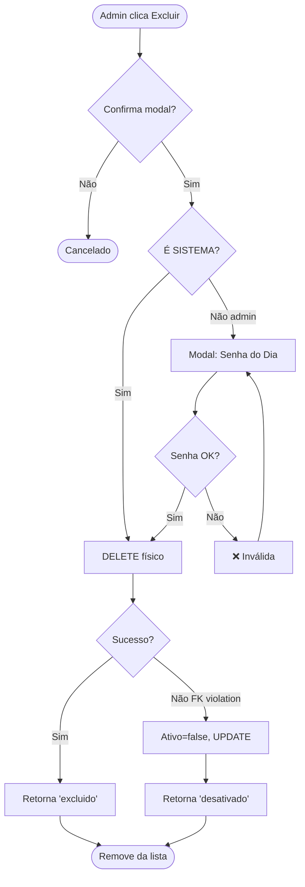
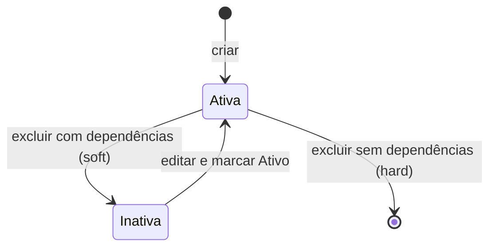

# Filiais — Spec

**Status:** ✅ Aprovado (módulo em produção)
**Última atualização:** 2026-04-19 — @aalessandre
**Código:** `backend/ZulexPharma.Infrastructure/Services/FilialService.cs` · `frontend/src/app/modules/filiais/`
**Help:** `/erp/help` → accordion **Filiais** _(a criar)_

---

## 1. Objetivo de Negócio

Cadastrar e gerenciar as **unidades físicas** (lojas/filiais) da rede. É a entidade-raiz de segregação de dados do ERP — todo movimento (venda, caixa, estoque, NFC-e, entrega) é sempre vinculado a uma filial. Sem filial cadastrada o sistema não opera.

**Dores que resolve:**
- Multi-loja: uma empresa com várias lojas precisa separar estoque, caixa, fiscal, relatórios dentre outrs controles por unidade.
- Compliance fiscal: a NFC-e/NFe é emitida com os dados da filial (CNPJ, IE, IBGE, endereço). Dado errado → rejeição SEFAZ.
- Logística: raio de entrega, faixas de preço e rota partem das coordenadas da filial.

**Quem usa:** usuarios com permissão concedida no esquema de permissões

---

## 2. Escopo

**Inclui:**
- CRUD de filial (criar, listar, editar, excluir/desativar).
- Enriquecimento automático de endereço via ViaCEP.
- Geocoding manual via Nominatim (para entregas).
- Toggle de participação em promoções.
- Vínculo com Conta Cofre (conta bancária que recebe sangrias).
- Histórico de auditoria.

**Não inclui:**
- Cadastro de faixas de entrega (`EntregaFaixa`) — tela separada, referenciada por `FilialId`.
- Cadastro de certificado digital A1 — tela separada (Configurações → Fiscal).
- Configurações fiscais avançadas (CSRT, responsável técnico, tokens) — em Configurações.
- Gestão de usuários da filial — em Usuários/Colaboradores.

---

## 3. Glossário

- **CNPJ:** cadastro nacional de pessoa jurídica, 14 dígitos, com dígito verificador (mod 11).
- **IE (Inscrição Estadual):** identificação fiscal estadual; pode ser "ISENTO" em alguns casos.
- **IBGE Município:** código de 7 dígitos único por município brasileiro, exigido pela SEFAZ.
- **ICMS:** imposto estadual; alíquota varia por UF. Usada no cálculo fiscal.
- **Conta Cofre:** conta bancária virtual que representa o "cofre físico" da filial; recebe transferências de sangrias do caixa.
- **Nominatim:** serviço público de geocoding baseado em OpenStreetMap.
- **ViaCEP:** API pública brasileira de consulta de CEP.

---

## 4. Atores / Permissões

| Ator | Ações | Bloqueio |
|------|-------|----------|
| **SISTEMA** (softwarehouse) | CRUD completo + histórico | Nenhum — bypass total (ver RN-12) |
| **Admin do cliente** (`IsAdministrador=true`) | CRUD completo + histórico | Precisa informar **senha do dia** a cada inclusão/alteração/exclusão |
| **Demais usuários** | Apenas leitura (consulta + seleção em outras telas) | Botões Adicionar/Editar/Excluir desabilitados |

> Filial é a entidade-raiz do ERP. Alteração errada quebra emissão fiscal, login, vínculos de caixa, etc. Por isso mesmo o admin do cliente **não** tem permissão direta — precisa do segundo fator "senha do dia" a cada operação de escrita.

---

## 5. Regras de Negócio (invariantes)

- **RN-01 — CNPJ único:** dois filiais não podem ter o mesmo CNPJ. Exceção: na edição, o próprio registro é ignorado.
- **RN-02 — CNPJ válido:** deve passar no algoritmo de dígito verificador (mod 11). Não aceita 14 dígitos iguais (`00000000000000`, `11111111111111`, etc.).
- **RN-03 — Campos obrigatórios:** `NomeFilial`, `RazaoSocial`, `NomeFantasia`, `Cnpj`, `Cep`, `Rua`, `Numero`, `Bairro`, `Cidade`, `Uf`, `Telefone`, `Email`, `AliquotaIcms`.
- **RN-04 — Texto em caixa alta:** todos os campos texto (exceto email) são armazenados em UPPERCASE. Email fica em lowercase.
- **RN-05 — Município IBGE obrigatório para fiscal:** para emitir NFC-e/NFe a filial **precisa** ter `MunicipioId` (FK). O código denormalizado `CodigoIbgeMunicipio` é auxiliar.
- **RN-06 — Exclusão com cascata impede hard-delete:** se a filial já tem movimentos (vendas, caixas, etc.), o DELETE físico é bloqueado pelo banco e o sistema faz soft-delete (`Ativo=false`) automaticamente.
- **RN-07 — Coordenadas opcionais, exigidas para entrega:** latitude/longitude não são obrigatórias para salvar, mas sem elas o módulo de Entregas bloqueia cálculo.
- **RN-08 — ICMS automático:** ao buscar o CEP, o sistema consulta `/api/icms-uf` e preenche `AliquotaIcms` com a alíquota da UF. Pode ser editado manualmente.
- **RN-09 — Auditoria obrigatória:** toda criação/alteração/exclusão gera `LogAcao` com campo-a-campo (antes/depois).
- **RN-10 — Conta Cofre opcional mas recomendada:** sem cofre definido, o caixa ainda abre, mas sangrias ficam pendentes de confirmação sem destino automático.
- **RN-11 — Auto-preenchimento por CNPJ (⏳ pendente):** ao informar um CNPJ válido, o sistema deve consultar **BrasilAPI** (com fallback para **ReceitaWS**) e auto-preencher Razão Social, Nome Fantasia e endereço. Campos preenchidos podem ser editados manualmente antes de salvar. Falha nas duas APIs → fluxo manual sem bloqueio. Padrão já existente em Fornecedores/Clientes/Convênios.
- **RN-13 — Dropdowns só listam itens ativos:** regra global do projeto. O select de **Conta Cofre** (e qualquer outro dropdown em Filiais) só mostra itens com `Ativo=true`. Ao **carregar uma filial para edição**, se o `contaCofreId` apontar para uma conta desativada, a FK é **limpa para null** antes de popular o form (o dropdown mostra "-- Nenhuma --" e o admin precisa escolher outra ou salvar como null). Não exibir inativos com marcação/sufixo "(inativa)" — decisão explícita do usuário. A conta permanece referenciada em registros históricos (caixa/sangrias antigas), só o uso NOVO é bloqueado.
- **RN-12 — Escrita exige admin + senha do dia (⏳ pendente):** **POST / PUT / DELETE** em filial só são permitidos se:
  - **(a)** usuário autenticado é `SISTEMA` (softwarehouse, bypass total); **ou**
  - **(b)** usuário tem `IsAdministrador=true` **E** fornece a senha do dia válida a cada operação.

  Não-admins recebem `403 Forbidden`. Admin sem senha do dia recebe `401 Unauthorized` (frontend abre modal de senha do dia). A senha é o **hash SHA-256** de `(yyyyMMdd_UTC + SistemaKey)` → primeiros 8 hex lowercase, expira à meia-noite UTC. Endpoint de obtenção (pra suporte): `GET /api/auth/senha-sistema?key=...` (protegido por API key em `appsettings`). Endpoint de validação: `POST /api/auth/validar-senha-sistema` (criar — ver §16).

---

## 6. Modelo de Dados

### Entidade `Filial`

| Campo | Tipo | Obrig. | Descrição |
|-------|------|--------|-----------|
| `Id` | long (PK) | auto | |
| `NomeFilial` | string | ✅ | Apelido interno (ex: "FILIAL 01") |
| `RazaoSocial` | string | ✅ | Razão social da PJ |
| `NomeFantasia` | string | ✅ | Nome fantasia (aparece em cupons) |
| `Cnpj` | string(14) | ✅ | Somente dígitos, único, validado |
| `InscricaoEstadual` | string? | — | Pode ser vazio/"ISENTO" |
| `Cep` | string(8) | ✅ | Somente dígitos |
| `Rua` | string | ✅ | |
| `Numero` | string | ✅ | String pra aceitar "S/N", "123-A" |
| `Bairro` | string | ✅ | |
| `Cidade` | string | ✅ | |
| `Uf` | string(2) | ✅ | Uppercase |
| `CodigoIbgeMunicipio` | string(7)? | — | Denormalizado do Municipio |
| `MunicipioId` | long? (FK) | — | FK autoritativa (obrigatória pra fiscal) |
| `Latitude` | decimal? | — | Graus decimais (WGS84) |
| `Longitude` | decimal? | — | Graus decimais |
| `Telefone` | string(11) | ✅ | |
| `Email` | string | ✅ | Lowercase |
| `AliquotaIcms` | decimal | ✅ | Ex: 19.50 |
| `IncluirPromoFixa` | bool | ✅ | Default true |
| `IncluirPromoProgressiva` | bool | ✅ | Default true |
| `ContaCofreId` | long? (FK) | — | → ContaBancaria |
| `Ativo` | bool | ✅ | BaseEntity, default true |
| `CriadoEm` | DateTime | auto | |

### Relacionamentos
- `Filial 1—1 Municipio` (via `MunicipioId`)
- `Filial 1—1 ContaBancaria` (via `ContaCofreId`, conta cofre)
- `Filial 1—N Usuario` (usuários dessa filial)
- `Filial 1—N EntregaFaixa` (faixas de entrega)
- `Filial 1—N CertificadoDigital` (certificados A1; normalmente 1 ativo)
- `Filial 1—N Caixa`, `Venda`, `Produto`, `Pessoa` … (praticamente tudo no ERP referencia Filial)

---

## 7. Fluxos

### Fluxo principal — Criar nova filial

```mermaid
flowchart TD
  Start([Usuário clica Adicionar]) --> GateUser{Perfil do usuário}
  GateUser -->|Não-admin| Bloq1[❌ Botão Adicionar desabilitado]
  GateUser -->|SISTEMA| Form
  GateUser -->|Admin| Form[Formulário em branco]
  Form --> DigCnpj[Digita CNPJ 14 dígitos]
  DigCnpj --> BuscarCnpj["BrasilAPI /cnpj/v1/{cnpj} (⏳ a implementar)"]
  BuscarCnpj --> CnpjOk{Achou?}
  CnpjOk -->|Sim| PreencheCnpj[Auto-preenche RZ, NF, CEP, Rua, Num, Bairro, Cidade, UF]
  CnpjOk -->|Não| Fallback["ReceitaWS /cnpj/{cnpj}"]
  Fallback --> FbOk{Achou?}
  FbOk -->|Sim| PreencheCnpj
  FbOk -->|Não| CepManual[Segue fluxo manual de endereço]
  PreencheCnpj --> CEP
  CepManual --> CEP[Digita/revisa CEP + blur]
  CEP --> ViaCEP{ViaCEP achou?}
  ViaCEP -->|Sim| Preenche[Auto-preenche Rua, Bairro, Cidade, UF, IBGE]
  ViaCEP -->|Não| Manual[Usuário preenche manualmente]
  Preenche --> ICMS[Busca /icms-uf pela UF → AliquotaIcms]
  ICMS --> Preencher[Completa telefone, email, IE]
  Manual --> Preencher
  Preencher --> Geo{Clica Buscar Coordenadas?}
  Geo -->|Sim| Nominatim[POST /geocoding/buscar]
  Nominatim --> GeoOk{Achou?}
  GeoOk -->|Sim| LatLng[Preenche Latitude/Longitude]
  GeoOk -->|Não| Alert[Aviso: endereço não encontrado]
  Geo -->|Não| Save
  LatLng --> Save
  Alert --> Save[Clica Salvar]
  Save --> GateSistema{É SISTEMA?}
  GateSistema -->|Sim| ValCnpj
  GateSistema -->|Não admin| ModalSenha[Modal: Senha do Dia]
  ModalSenha --> InputSenha[Admin digita senha 8 chars]
  InputSenha --> ValidaSenha["POST /auth/validar-senha-sistema"]
  ValidaSenha --> SenhaOk{Senha OK?}
  SenhaOk -->|Não| ErroSenha[❌ Senha inválida / expirada]
  ErroSenha --> InputSenha
  SenhaOk -->|Sim| ValCnpj{CNPJ válido e único?}
  ValCnpj -->|Não| ErroCnpj[Erro: CNPJ inválido/duplicado]
  ValCnpj -->|Sim| ValReq{Obrigatórios OK?}
  ValReq -->|Não| ErroReq[Erro: preencha X]
  ValReq -->|Sim| Persist[INSERT Filial + LogAcao + auditoria da liberação]
  Persist --> End([Volta pra lista + toast sucesso])
```



**Passos comentados:**
1. **Gate de perfil (entrada)** — não-admin nem vê os botões Adicionar/Editar/Excluir. Aplica **RN-12 (a/b/c)**.
2. **CNPJ auto-busca** — ao completar 14 dígitos, tenta **BrasilAPI** e faz fallback pra **ReceitaWS**. Aplica **RN-11**. ⏳ ainda não implementado em Filiais.
3. **CEP** — dispara ViaCEP no blur (`onCepBlur`). Aplica **RN-08**. Roda mesmo se CNPJ já trouxe endereço, pra garantir IBGE/ICMS.
4. **Geocoding** — é **opcional** e manual (botão). Aplica **RN-07**.
5. **Gate senha do dia (saída)** — SISTEMA passa direto; admin precisa validar senha **a cada save**. Se inválida, fica travado no modal. Aplica **RN-12**.
6. **Validações** — ordem: RN-02 (CNPJ válido) → RN-01 (único) → RN-03 (obrigatórios).
7. **Persistência** — `CriarAsync` normaliza texto (**RN-04**), salva, loga (**RN-09**) incluindo o fato de que houve liberação via senha do dia (quem, quando).

### Fluxo alternativo — Editar filial existente
Idêntico ao fluxo principal, com duas diferenças:
- Na validação de unicidade de CNPJ, ignora o próprio registro.
- `UPDATE` em vez de `INSERT`; log compara antes/depois campo-a-campo, só grava se houve mudança.

### Fluxo alternativo — Excluir filial



Aplica **RN-06**. Frontend mostra mensagem diferente para "excluída" vs "desativada".

---

## 8. Máquina de Estado

Filial tem apenas o estado `Ativo` (bool). Não há workflow complexo.



---

## 9. Contratos de API

**Base:** `/api/filiais`

| Verbo | Rota | Request | Response | Erros |
|-------|------|---------|----------|-------|
| GET | `/filiais` | — | `{ success, data: FilialListDto[] }` | 401 |
| POST | `/filiais` | `FilialFormDto` | `{ success, data: FilialListDto }` (201) | 400 (validação), 409 (CNPJ dup) |
| PUT | `/filiais/{id}` | `FilialFormDto` | `{ success }` | 400, 404 |
| DELETE | `/filiais/{id}` | — | `{ success, resultado: "excluido"\|"desativado" }` | 404 |
| GET | `/filiais/{id}/log` | `?dataInicio&dataFim` | `{ success, data: LogEntry[] }` | 404 |

### FilialFormDto (request)
Todos os campos da entidade **exceto** `Id`, `CriadoEm`. `Ativo` default true.

### FilialListDto (response)
Todos os campos da entidade + `ContaCofreNome` (string joined).

---

## 10. Validações

| Campo | Regra | Erro |
|-------|-------|------|
| `Cnpj` | 14 dígitos + dígito verificador + único | "CNPJ inválido" / "CNPJ já cadastrado" |
| `NomeFilial`, `RazaoSocial`, `NomeFantasia` | Não vazio | "Campo obrigatório" |
| `Cep` | 8 dígitos | "CEP inválido" |
| `Uf` | 2 letras | "UF inválida" |
| `Email` | Formato email | "E-mail inválido" |
| `Telefone` | 10-11 dígitos | "Telefone inválido" |
| `AliquotaIcms` | ≥ 0 | "Alíquota inválida" |

Validações de máscara (visual) no frontend + validações de negócio no backend.

---

## 11. Integrações Externas

### ViaCEP (endereço)
- **Endpoint:** `https://viacep.com.br/ws/{cep}/json/` (público, sem auth)
- **Trigger:** frontend, no blur do campo CEP (8 dígitos)
- **Uso:** auto-preenche Rua, Bairro, Cidade, UF, IBGE
- **Falha:** silenciosa (usuário preenche manualmente)

### Nominatim (geocoding)
- **Endpoint:** `POST /api/geocoding/buscar` (backend proxy) → Nominatim OSM
- **Trigger:** botão "Buscar Coordenadas" no form
- **Uso:** preenche Latitude/Longitude
- **Rate limit:** 1 req/s (política Nominatim); timeout 5s
- **Falha:** exibe aviso, usuário pode preencher manual

### ICMS-UF (alíquota)
- **Endpoint interno:** `GET /api/icms-uf`
- **Trigger:** após ViaCEP, quando UF muda
- **Uso:** preenche `AliquotaIcms` com a alíquota da UF

### Senha do Dia (senha-sistema) — ⏳ **Parcialmente implementado**
- **Endpoint de obtenção (softwarehouse):** `GET /api/auth/senha-sistema?key={apiKey}` — ✅ **Já existe** ([AuthController.cs:79](../../backend/ZulexPharma.API/Controllers/AuthController.cs#L79)).
  - Protegido por `SistemaApiKey` em `appsettings.json`.
  - Retorna `{ login: "SISTEMA", senha: "a3f7b1c9", data, aviso }`.
  - Uso: atendente da softwarehouse bate o endpoint (via Postman/CLI) e passa a senha por telefone/WhatsApp pro cliente.
- **Endpoint de validação (criar):** `POST /api/auth/validar-senha-sistema` — ⏳ **Falta criar**.
  - Body: `{ senha: "a3f7b1c9" }`. Requer JWT do usuário admin autenticado.
  - Recomputa hash SHA-256(`yyyyMMdd_UTC + SistemaKey`)[..8] e compara. Retorna `{ valido: true/false }`.
  - Alternativa mais segura: não expor endpoint de validação pública — em vez disso, enviar a senha **junto** com o payload da operação (header `X-Senha-Sistema` ou campo no DTO) e validar dentro do próprio `POST/PUT/DELETE /filiais`. Escolher essa rota reduz superfície de ataque.
- **Lógica de cálculo** (idêntica ao endpoint de obtenção):
  ```
  data = DateTime.UtcNow.ToString("yyyyMMdd")
  chave = appsettings["SistemaKey"]            // ex: "ZulexPharma2026!"
  hash = SHA256(data + chave)
  senha = HEX(hash)[0..8].ToLower()             // 8 chars, ex: "a3f7b1c9"
  ```
- **Expiração:** meia-noite UTC. Pode cruzar data quando cliente está em fuso longe de UTC (madrugada no BR ainda é dia anterior UTC até 21h). Aceito como simplicidade.
- **Registro de uso:** toda operação liberada por senha do dia deve gerar entrada em `LogAcao` marcando "liberado via senha-sistema" + usuário admin que usou. Aplica **RN-09** + **RN-12**.

### BrasilAPI + ReceitaWS (dados do CNPJ) — ⏳ **Não implementado em Filiais**
- **Endpoint 1 (principal):** `GET https://brasilapi.com.br/api/cnpj/v1/{cnpj}` (público, sem auth)
- **Endpoint 2 (fallback):** `GET https://receitaws.com.br/v1/cnpj/{cnpj}` (público; rate-limit mais apertado)
- **Trigger ideal:** ao completar os 14 dígitos do CNPJ no form (frontend).
- **Uso:** auto-preenche `RazaoSocial`, `NomeFantasia`, `Cep`, `Rua`, `Numero`, `Bairro`, `Cidade`, `Uf` a partir da base da Receita Federal. Depois o ViaCEP ainda pode rodar pra garantir IBGE/ICMS.
- **Status atual:** já implementado em [`fornecedores.component.ts`](../../frontend/src/app/modules/fornecedores/fornecedores.component.ts#L950), `clientes.component.ts` e `convenios.component.ts`. Em **Filiais ainda NÃO** — exigir implementação (ver §16).
- **Falha:** se ambos falharem (offline, CNPJ não achado), seguir fluxo manual (o CNPJ digitado continua válido, só não auto-preenche).
- **Padrão de código a reaproveitar:** método `buscarCnpj(cnpj)` + `aplicarDadosCnpj(...)` do fornecedores.

---

## 12. UI — Estrutura

### Tela — Modo Lista
- **Sidebar:** Procurar · Adicionar · Editar · Sair · Abas abertas
- **Filtros:** busca livre (NomeFilial, NomeFantasia, RazaoSocial, CNPJ, Cidade) + status (Ativos/Inativos/Todos)
- **Grid:**
  - Colunas padrão: ID, Razão Social, Nome Fantasia, Apelido, CNPJ, Cidade, UF, Ativo
  - Colunas opcionais: E-mail, Telefone, IE, CEP, Rua, Número, Bairro
  - Colunas configuráveis (toggle, resize, drag); estado em `localStorage`
  - Sort click em header
  - Duplo-clique ou F2/Enter → edita
- **Atalhos:** ↑/↓ navegar · F2/Enter editar · Esc sair

### Tela — Modo Form
Organizada em seções visuais:
1. **Código & Status** — Id, CriadoEm, toggle Ativo
2. **Identificação** — CNPJ, RZ, NF, Apelido, IE
3. **Endereço** — CEP (+ botão lookup), Rua, Número, Bairro, Cidade, UF, IBGE, ICMS %
4. **Coordenadas** — Latitude, Longitude, botão "Buscar Coordenadas"
5. **Contato** — Telefone, E-mail
6. **Promoções** — toggles fixas + progressivas
7. **Financeiro** — dropdown Conta Cofre

**Máscaras:** CNPJ `##.###.###/####-##` · Telefone `(##) #####-####` · CEP `#####-###`

**Toolbar:** Salvar (se dirty) · Cancelar · Fechar · Histórico (edit) · Excluir (edit)

**Atalhos:** Ctrl+S salvar · Esc fechar/cancelar

### Multi-tab
- Múltiplas filiais abertas em edição simultânea.
- Estado persistido em `sessionStorage`.
- Fechar aba com alterações não salvas → confirmação.

### Modal de Histórico
- Filtro por data (default últimos 30 dias)
- Lista cronológica de ações (CRIAÇÃO/ALTERAÇÃO/EXCLUSÃO/DESATIVAÇÃO)
- Diff campo-a-campo (anterior → atual)

---

## 13. Efeitos Colaterais

- **Criar filial** — nenhum efeito cascade; filial nasce vazia (sem caixas, sem estoque).
- **Desativar filial** — operadores dessa filial não conseguem fazer login nela; vendas/caixas existentes continuam consultáveis.
- **Alterar CNPJ/endereço** — **impacta NFC-e em emissão**. O certificado digital está vinculado ao CNPJ da filial. Alterar CNPJ depois de emitir → novas emissões falham. Na prática: alterar CNPJ exige trocar o certificado.
- **Alterar IBGE/UF** — futuras NFC-e usam a UF nova (geografia fiscal muda). Histórico não é reescrito.
- **Alterar ICMS** — impacta só cálculos futuros; cupons já emitidos guardam alíquota no item.

---

## 14. Critérios de Aceite

- [x] Criar filial com todos os campos válidos → salva e aparece na lista.
- [x] Criar filial com CNPJ duplicado → erro "CNPJ já cadastrado".
- [x] Criar filial com CNPJ inválido (dígito verificador errado) → erro "CNPJ inválido".
- [ ] **⏳** Usuário não-admin tenta abrir Adicionar/Editar/Excluir → botões desabilitados ou 403 no backend. _(Pendente RN-12)_
- [ ] **⏳** Admin clica Salvar → modal de senha do dia abre antes do POST/PUT. _(Pendente RN-12)_
- [ ] **⏳** Admin informa senha do dia correta → operação prossegue; LogAcao registra liberação. _(Pendente RN-12)_
- [ ] **⏳** Admin informa senha errada → erro, modal continua aberto, operação não roda. _(Pendente RN-12)_
- [ ] **⏳** Admin informa senha do dia anterior (já expirada) → tratada como inválida. _(Pendente RN-12)_
- [ ] **⏳** Login como SISTEMA → salva direto, sem modal de senha. _(Pendente RN-12)_
- [ ] **⏳** Digitar CNPJ válido (14 dígitos) → BrasilAPI preenche Razão Social, Nome Fantasia e endereço. _(Pendente RN-11)_
- [ ] **⏳** BrasilAPI offline/falha → ReceitaWS é chamada como fallback. _(Pendente RN-11)_
- [x] Digitar CEP válido → Rua/Bairro/Cidade/UF/IBGE/ICMS preenchem automaticamente.
- [x] Digitar CEP inválido → sem auto-preenchimento, permite digitar manual.
- [x] Clicar "Buscar Coordenadas" com endereço válido → Latitude/Longitude preenchem.
- [x] Editar filial → CNPJ próprio aceito; outro CNPJ já usado rejeitado.
- [x] Excluir filial sem dependências → some da lista.
- [x] Excluir filial com dependências (tem caixa/venda) → fica "Inativa" na lista.
- [x] Consultar histórico → mostra alterações campo-a-campo.
- [x] Atalhos Ctrl+S, F2, Esc funcionam nos dois modos.
- [x] Colunas configuradas persistem após F5.
- [x] Dropdown de Conta Cofre lista só contas ativas (RN-13).
- [x] Abrir filial cuja Conta Cofre foi desativada → campo exibe "-- Nenhuma --" e o valor fica limpo (RN-13).

---

## 15. Decisões & Tradeoffs

- **Dropdowns só ativos, sem exibir inativos marcados:** testamos mostrar item desativado com sufixo "(inativa)" e o usuário rejeitou — prefere que simplesmente suma. Tradeoff: ao abrir uma filial antiga com referência a conta desativada, o campo aparece vazio sem explicação. Mitigação: mensagem de erro clara se tentar salvar um cadastro que exige a FK (ex: "Selecione uma Conta Cofre ativa"). Vale pra todos os dropdowns do projeto — regra global.
- **Segundo portão (senha do dia) em vez de liberação por supervisor:** supervisores do cliente erram — liberariam por descuido ou pressão. A senha do dia exige contato ativo com a softwarehouse, criando fricção intencional. Tradeoff: depende da softwarehouse estar disponível pra passar a senha. Mitigação: o atendente da softwarehouse pode calcular offline se tiver a `SistemaKey` em mãos.
- **SISTEMA bypass, não senha:** o usuário `SISTEMA` (softwarehouse) não precisa passar por modal de senha do dia — ele É o portão. Tradeoff: senha do usuário SISTEMA vira chave do reino; deve ser rotacionada periodicamente (fora do escopo desta tela).
- **Hash SHA-256 em vez de fórmula aritmética:** discutido e descartado `ano × mês × dia × diaSemana × chave`. SHA é calculável em qualquer linguagem, não requer memorização, e dificulta dedução por inspeção visual do código. Tradeoff: softwarehouse precisa de ferramenta (endpoint ou script) pra gerar — aceito.
- **Texto em UPPERCASE:** padronização visual em cupons/relatórios. Tradeoff: se amanhã alguém quiser "Drogaria São José" bonito, precisa mudar em vários lugares. Decisão aceita.
- **Soft-delete automático por FK:** evita bloqueio cirúrgico ao admin. Tradeoff: filial some dos filtros "Ativos" mas continua referenciada; cupons antigos ainda trazem o nome dela. OK.
- **Geocoding automático após ViaCEP (silencioso):** ao buscar o CEP, o sistema dispara geocoding em seguida e preenche lat/lng sem avisar o usuário. Falha silenciosa (botão "Buscar Coordenadas" fica como fallback manual). Tradeoff: se Nominatim estiver com rate limit, o cadastro fica sem coordenadas e Entregas trava; nesse caso o admin clica manualmente mais tarde. Decisão: a conveniência vence o risco — a maioria dos cadastros roda UMA vez e a chance de rate limit em single-shot é baixa.
- **Conta Cofre opcional:** pra não travar cadastro inicial. Na prática 100% das filiais em produção têm.
- **`CodigoIbgeMunicipio` redundante com `MunicipioId`:** herança histórica (antes era string). Mantemos os dois; `MunicipioId` é a autoridade. Futuro: remover a string.

---

## 16. Pendências / Futuro

- [ ] **🔒 Escrita exige admin + senha do dia (RN-12)** — prioridade alta, bloqueia risco de alteração indevida por admin do cliente. Escopo:
  - **Backend:** criar `POST /api/auth/validar-senha-sistema` **OU** (preferível) validar senha inline em `POST/PUT/DELETE /filiais` via header `X-Senha-Sistema` ou campo no DTO.
  - **Backend:** em `FilialService.Criar/Atualizar/Excluir`, verificar `usuario.IsAdministrador || usuario.Login == "SISTEMA"` → 403 se falhar; se for admin não-SISTEMA, exigir senha do dia válida → 401 se inválida.
  - **Backend:** registrar em `LogAcao` quem liberou + tipo "liberação via senha-sistema".
  - **Frontend:** desabilitar botões Adicionar/Editar/Excluir pra não-admin; ao salvar/excluir, se não for SISTEMA, abrir **ModalSenhaDia** reaproveitando o padrão do `ModalSenhaService`.
  - **Frontend:** no erro 401 do backend, reabrir modal com mensagem "senha inválida".
  - Esforço estimado: 2-3h (backend 1h + frontend 1-2h).
- [ ] **Auto-busca de CNPJ (BrasilAPI + ReceitaWS)** — implementar em Filiais o mesmo padrão já usado em [Fornecedores L950-976](../../frontend/src/app/modules/fornecedores/fornecedores.component.ts#L950). Aplica **RN-11**. Esforço: ~30 min (copiar `buscarCnpj` + `aplicarDadosCnpj` e chamar no `onCnpjInput` quando completar 14 dígitos).
- [ ] **Remover `CodigoIbgeMunicipio` (string)** — deixar só `MunicipioId` (FK). Requer migration + ajuste nos DTOs que usam a string.
- [ ] **Validação: exigir MunicipioId se filial emite NFC-e** — hoje só validamos na hora da emissão. Melhor bloquear no cadastro.
- [ ] **Exibir n° de certificados ativos por filial na lista** — badge/contador.
- [ ] **Aba "Usuários da Filial"** — hoje precisa ir em Usuários e filtrar manual.
- [ ] **Aba "Faixas de Entrega"** — consolidar no cadastro de Filial em vez de tela separada.
- [ ] **Clonar filial** — pra redes que abrem nova loja com dados parecidos.
- [ ] **Importação em massa (CSV)** — útil para redes com >20 lojas migrando.

---

## 17. Referências

- Código: [`FilialService.cs`](../../backend/ZulexPharma.Infrastructure/Services/FilialService.cs), [`filiais.component.ts`](../../frontend/src/app/modules/filiais/filiais.component.ts)
- Entidade: [`Filial.cs`](../../backend/ZulexPharma.Domain/Entities/Filial.cs)
- Help (accordion): ainda não documentado
- Memory: `project_zulexpharma.md`
