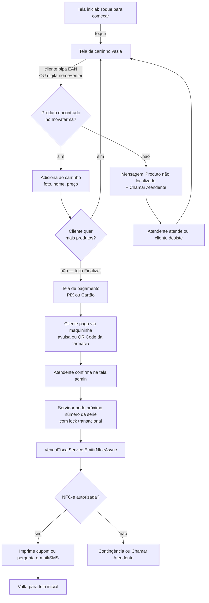
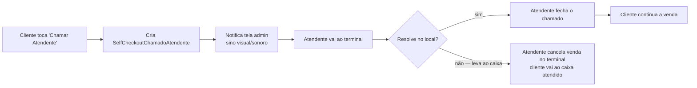
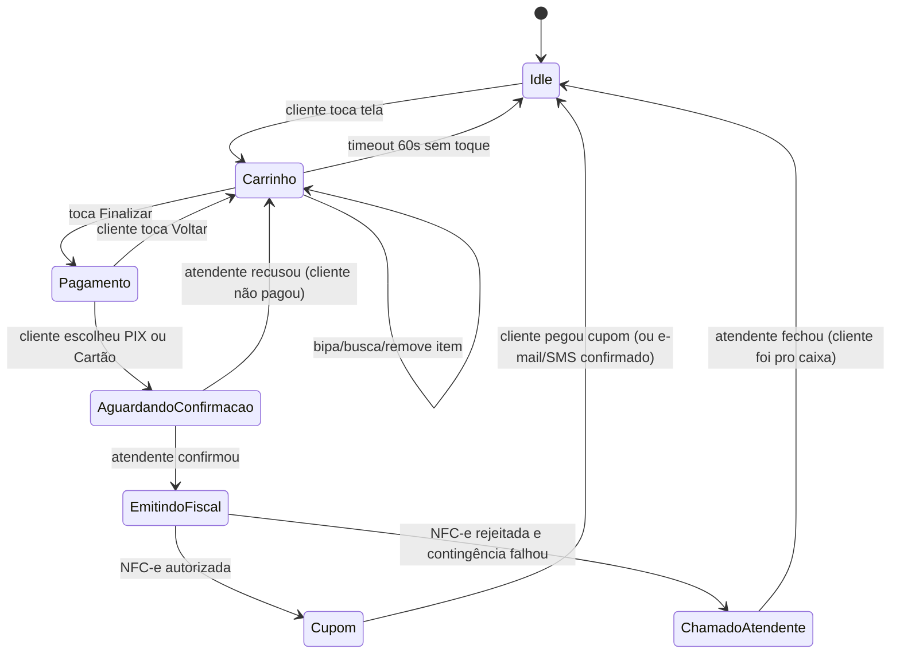

# Self-Checkout (Auto-Atendimento de Farmácia) — Spec

**Status:** ✅ MVP funcional — Fatias 1-5 concluídas com smoke test fim-a-fim aprovado em 2026-04-26. Próximo marco: Fase 2 (integração SmartTEF).
**Última atualização:** 2026-04-26 — @aalessandre
**Código alvo:** `backend/ZulexPharma.Infrastructure/Services/SelfCheckout/` (a criar) · `frontend/src/app/modules/self-checkout/` (a criar) · `frontend/src/app/modules/configuracoes/` (accordion novo)
**Depende de:** Filial · CertificadoDigital · Venda · VendaItem · VendaFiscal (NFC-e) · CriptografiaHelper · Sistema de permissões
**Help:** `/erp/help` → accordion **Self-Checkout** (a criar)

---

## 1. Objetivo de Negócio

Oferecer um terminal de **auto-atendimento (self-checkout)** dentro da farmácia, onde o cliente final passa os produtos no leitor de código de barras e finaliza a compra (PIX/cartão) **sem precisar passar pelo caixa atendido**. Reduz fila de "compras rápidas" (perfumaria, higiene, MIP, conveniência), libera o atendente humano para vendas que exigem orientação farmacêutica.

**Dores que resolve:**
- Fila no caixa para compra de produtos simples (shampoo, sabonete, lixa, MIP) frusta cliente e custa venda perdida.
- Atendente do caixa fica preso em compras de baixa orientação enquanto clientes que precisam do farmacêutico esperam.
- Farmácia sem self-checkout perde competitividade vs grandes redes (Drogasil, Pague Menos) que já oferecem.

**Quem usa:**
- **Cliente final** — opera o terminal sozinho, sem login.
- **Atendente da farmácia** — supervisão visual + chamado pelo botão "chamar atendente" em casos excepcionais.
- **Admin/gerente** — configura credenciais do ERP origem, série da NFC-e dedicada, terminais cadastrados.

**Modelo comercial:** SaaS. Farmácia adquire o hardware (PC touch all-in-one + leitor + impressora térmica + pinpad) e paga licença mensal pelo software. Já existem farmácias interessadas; piloto numa farmácia que usa **Inovafarma** como ERP.

---

## 2. Escopo

**Inclui (Fase 1 / MVP):**
- Novo módulo "Self-Checkout" dentro do ZulexPharma (não fork).
- Tela kiosk fullscreen dedicada (rota `/kiosk`), sem reuso da tela `caixa-venda` atual.
- Leitura de produto via leitor de código de barras (USB HID) + campo de busca por nome (teclado virtual touch).
- Conexão com banco do ERP da farmácia para consulta de produto/preço/promoção. **Inovafarma** como primeiro conector (SQL Server direto).
- Pattern `IErpConnector` para suportar múltiplos ERPs no futuro.
- Accordion "Self-Checkout" em Configurações: dropdown de ERP, host/banco/usuário/senha (criptografada), filial do ERP, série da NFC-e dedicada, terminais cadastrados.
- Reuso da entidade `Filial` para dados fiscais do emitente (CNPJ, IE, IBGE, UF, certificado digital).
- Reuso de `IVendaFiscalService.EmitirNfceAsync` para emissão da NFC-e.
- Numeração centralizada de NFC-e (nova tabela `SequenciaCentral`) — evita colisão entre múltiplos terminais da mesma filial.
- Reuso das tabelas `Venda` + `VendaItem` com novo valor de enum `VendaOrigem.SelfCheckout` + novo campo `SelfCheckoutTerminalId`.
- Pagamento na Fase 1 = **manual confirmado por atendente** (atendente vê o pagamento PIX/cartão pelo celular/maquininha avulsa e confirma na tela administrativa).
- Botão "Chamar atendente" sempre visível no kiosk.
- Tela de tratamento "EAN não cadastrado" com botão "Chamar atendente".
- Permissões novas: `self-checkout:a` (configurar) e `self-checkout:c` (supervisionar/relatórios).

**Inclui (Fase 2):**
- Integração com **SmartTEF** (agrega Cielo, Stone, Rede etc.) para PIX/cartão automático.
- Idempotência transacional na chamada do TEF (ID único persistido antes de chamar).

**Inclui (Fase 3):**
- Conector para outros ERPs (além de Inovafarma).
- API oficial dos ERPs (substituir conexão direto no banco).
- Baixa de estoque no ERP origem (Inovafarma) — hoje não escreve, fica conciliação por relatório.

**Não inclui:**
- Bloqueio de produto controlado/com receita por categoria — cliente só pega o que está na área aberta da farmácia, não tem como levar controlado. Decisão consciente para escopo enxuto.
- Convênios (Farmácia Popular, Vidalink, Funcional) — exigem biometria/cartão presencial, não funcionam em self-checkout.
- Vale-alimentação, vale-refeição, dinheiro físico — apenas PIX/cartão.
- Abertura/fechamento de caixa — sem dinheiro, sem operador, sem turno (modelo diferente do PDV atendido).
- Programa de fidelidade próprio do self-checkout (CPF na nota é opcional).
- Pesagem de carrinho, câmera com computer vision, RFID antifurto — mitigação de furto fica com supervisão visual humana + antifurto na saída.
- Múltiplas embalagens com mesmo EAN, fracionado, granel, manipulado — fora da área aberta, não chega ao terminal.
- Geração/parse de relatório de conciliação financeira automatizado — Fase 1 manual.

---

## 3. Glossário

- **Self-checkout / kiosk / terminal:** PC touch all-in-one (ou PC + monitor touch) onde o cliente bipa produtos e paga sem atendente.
- **MIP:** Medicamento Isento de Prescrição — categoria que pode ser vendida sem receita (ex: dipirona 500mg comum).
- **Área aberta:** parte da loja onde o cliente pega produtos sozinho (gôndolas livres). Tudo que está na área aberta é elegível para self-checkout.
- **ERP origem:** ERP que a farmácia já usa (no piloto, **Inovafarma**). Self-checkout consulta produto/preço dele em modo leitura. Não escreve.
- **Connector:** classe que implementa `IErpConnector` para um ERP específico (ex: `InovafarmaConnector`).
- **Filial Inovafarma:** o Inovafarma cria um banco SQL Server por filial (ex: `INOVAFARMA_FARMACIAMAXIFARMA_FILIAL3`). A connection string já segrega; pode haver `filial_id` em filtros internos.
- **Terminal:** unidade física do self-checkout. Uma filial pode ter N terminais.
- **Série dedicada:** número de série da NFC-e exclusivo do self-checkout (ex: 100), separado da série do caixa atendido — facilita conciliação fiscal.
- **Sequência central:** numeração de NFC-e gerada pelo servidor central da farmácia, com lock transacional, evitando colisão entre terminais simultâneos.
- **SmartTEF:** empresa terceirizada que agrega adquirentes (Cielo, Stone, Rede, etc.) e expõe API única — usada na Fase 2.
- **Pagamento manual confirmado:** Fase 1 — atendente vê o pagamento via outro canal (maquininha avulsa, celular do PIX) e confirma na tela. Sem integração TEF.
- **Modo kiosk de SO:** Windows Assigned Access (ou similar) que bloqueia Alt+Tab/Win/Ctrl+Alt+Del — o cliente não consegue sair do app.

---

## 4. Atores / Permissões

| Ator | Ações | Permissão |
|------|-------|-----------|
| Cliente final | Bipar produto, buscar por nome, pagar, emitir NFC-e | (sem login — terminal opera com usuário virtual fixo da filial) |
| Atendente da farmácia | Confirmar pagamento manual (Fase 1), atender chamado, destravar EAN não cadastrado | `self-checkout:c` |
| Admin/gerente | Configurar ERP origem, credenciais, terminais, série de NFC-e | `self-checkout:a` |

---

## 5. Regras de Negócio (invariantes)

- **RN-01 — Sem login do cliente:** terminal opera com **usuário virtual** "Operador Self-Checkout" criado uma vez por filial. Vendas ficam atribuídas a esse usuário; rastreamento individual da compra é por `SelfCheckoutTerminalId` na venda.
- **RN-02 — Sem abertura/fechamento de caixa:** self-checkout não usa o conceito de `Caixa` aberto. Vendas vão direto para `Venda` com `VendaOrigem.SelfCheckout` e `CaixaId = null`.
- **RN-03 — Apenas PIX e cartão:** formas de pagamento permitidas são exclusivamente PIX e cartão (crédito/débito). Dinheiro, vale, convênio são bloqueados.
- **RN-04 — NFC-e obrigatória:** toda venda do self-checkout emite NFC-e modelo 65. Nunca finaliza venda sem NFC-e autorizada — se SEFAZ rejeitar, fluxo de contingência (mesmo do caixa atual). Se contingência também falhar, venda fica pendente, atendente é acionado.
- **RN-05 — Numeração centralizada via `SequenciaCentralService`:** série e número de partida configurados no accordion **Fiscal / NFC-e** (`fiscal.nfce.serie` e `fiscal.nfce.numero.atual`). Numeração reservada atomicamente via `SELECT ... FOR UPDATE` em transação Serializable — protege colisão entre N caixas/terminais emitindo simultaneamente.
  - **Quando o caixa atendido também é ZulexPharma**: série compartilhada entre caixa + Self-Checkout (uma sequência só por filial).
  - **Quando o caixa atendido é OUTRO ERP** (ex: Inovafarma) **— cenário do piloto atual**: o Self-Checkout precisa de **série dedicada** que o ERP do balcão não usa (ex: 100, 200…). Caso contrário, SEFAZ rejeita com `cStat=539 (Duplicidade de NF-e)` porque a sequência interna do ZulexPharma fica atrás dos números já registrados pelo outro ERP. **Operacional**: admin verifica no Portal SEFAZ qual série está livre e configura no accordion Fiscal.
- **RN-06 — Reuso da entidade Filial:** dados fiscais do emitente (CNPJ, IE, IBGE, UF, certificado) **vêm da `Filial` existente** — não são duplicados no accordion. Accordion só guarda config específica do self-checkout.
- **RN-07 — Conexão ao ERP origem só pelo servidor:** **apenas o servidor central** da farmácia conecta no banco do Inovafarma. Os terminais conversam com o servidor via API HTTP do próprio ZulexPharma — nunca direto no SQL Server externo. Centraliza credencial, segurança, cache.
- **RN-08 — Senha do banco externo criptografada:** senha do usuário do banco do Inovafarma é gravada criptografada (`CriptografiaHelper.Encrypt`). Descriptografar só no momento de abrir a conexão.
- **RN-09 — Self-checkout não escreve no Inovafarma (Fase 1):** venda fica registrada **apenas no banco do ZulexPharma**. Estoque do Inovafarma fica divergente até conciliação manual (relatório). Tabela `SelfCheckoutConciliacaoEstoque` fica preparada para escrita futura (Fase 3).
- **RN-10 — EAN não cadastrado:** se `IErpConnector.BuscarProdutoPorEan` retornar nulo, mostrar tela "Produto não localizado" + botão "Chamar atendente". Não trava a tela.
- **RN-11 — Botão "Chamar atendente" sempre visível:** em qualquer estado da tela (idle, carrinho, pagamento). Acionar dispara notificação no servidor (sino visual/sonoro na tela administrativa). Implementação concreta da notificação fica para Fase 1.
- **RN-12 — Timeout de inatividade:** ~~descarta carrinho após 60s sem toque~~ **DESATIVADA em 2026-04-26 por feedback de uso.** Carrinho persiste indefinidamente até o cliente finalizar ou cancelar explicitamente. Venda só persiste após pagamento aprovado + NFC-e autorizada. Pode ser revisitada se aparecer cenário de carrinho abandonado bloqueando o terminal.
- **RN-13 — Pagamento Fase 1 manual:** atendente confirma o recebimento na tela administrativa do servidor (não no terminal kiosk). O cliente vê "aguardando confirmação do atendente". Sem essa confirmação, NFC-e não é emitida.
- **RN-14 — Idempotência de pagamento (Fase 2):** chamada ao SmartTEF deve persistir um `IdTransacaoTef` único **antes** de chamar a API. Se terminal travar entre "pagamento aprovado" e "NFC-e emitida", a retomada usa o mesmo ID — não cobra duas vezes.
- **RN-15 — Sem filtro de produto:** busca por nome retorna **tudo** que existe no Inovafarma. Cliente não tem como bipar/comprar produto controlado porque não tem em mãos (não está na área aberta). Decisão consciente — escopo enxuto.
- **RN-16 — Sem múltiplas embalagens / fracionado / granel:** produtos da área aberta têm EAN unitário simples. Fracionado/granel/manipulado ficam atrás do balcão e não passam pelo self-checkout.
- **RN-17 — Cupom: impresso ou digital:** após NFC-e autorizada, cliente escolhe cupom impresso (térmica) OU digital (e-mail/SMS — exige consentimento explícito conforme LGPD). Padrão: impresso.
- **RN-18 — Cancelamento da venda só por atendente:** depois da NFC-e autorizada, o cliente **não pode** cancelar pelo terminal. Botão "Chamar atendente" vira o caminho. Cancelamento de NFC-e segue o fluxo padrão do módulo Fiscal.
- **RN-19 — Preço final: menor entre preço cheio e todas as promoções aplicáveis:** ao consultar produto no Inovafarma, calcular `PrecoFinal = min(PrecoCheio, PromocoesAplicaveis)` considerando **duas fontes** simultâneas:
  - **Promoção simples no estoque** (`Produto_Estoque.PrecoPromocao` + `DataPromocaoInicio`/`DataPromocaoFim`) — promoção fixa por filial, vigente quando `Hoje` está entre as datas (NULL = vitalícia) e `PrecoPromocao > 0`. Aplica direto, sem outras restrições.
  - **Promoção elaborada** (`Promocao` + `Promocao_Produto`) — vigente quando `Promocao.Ativo = 1`, `DataInicio <= Hoje`, `(DataFim IS NULL OR DataFim >= Hoje)`, `ExclusivoConvenio = 0`, `ExclusivoEcommerce = 0`. Restrições obrigatórias:
    - **Filial** (`Promocao_Empresa`): `INNER JOIN` por `CodigoEmpresa = filial atual`. O Inovafarma sempre cadastra a filial — não há caso "global".
    - **Dia da semana** (`Promocao_DiaSemana`): vazio = vale todo dia. Com registros = só nos dias listados (`Dia` segue convenção SQL Server: 1=Domingo, 7=Sábado).
  - Se o produto está em múltiplas promoções vigentes, **vale o menor preço final** entre todas as fontes.
  - Promoções com `QuantidadeLevar`/`QuantidadePagar` (leve-N-pague-M) ficam **fora do MVP** — ignorar inicialmente.
  - `Promocao.Tipo` e `Promocao.Origem` (tinyints) — ignorados no MVP (semântica não documentada).
- **RN-21 — Flags de plano de pagamento ignoradas no MVP:** as flags `PlanoVista`, `PlanoCartao`, `PlanoCarteiraDigital`, `PlanoPrazo`, `PlanoCheque` da `Promocao` **não são consultadas** no MVP. Motivo: o preço cadastrado na promoção é único (não há valor diferente por forma de pagamento) — as flags só dizem se a promoção é elegível para aquela forma. Aplicar a regra exigiria saber a forma de pagamento **antes** de bipar produtos, o que prejudica a UX do kiosk. Decisão consciente: pegar sempre o menor preço promocional disponível, independente da forma. Pode ser revisitada se aparecer caso real de promoção exclusiva para um plano (ex: "só no cartão") sendo aplicada indevidamente.
- **RN-22 — Produto totalmente externo, sem espelho local:** no MVP, **o ZulexPharma não cadastra produto interno** para vendas do self-checkout. Cada venda referencia produto que vive apenas no banco do Inovafarma. Implicações:
  - `VendaItem.ProdutoId` deixa de ser FK obrigatória → muda para `long?` (nullable). Vendas do self-checkout gravam `ProdutoId = null`.
  - Os campos string já existentes em `VendaItem` (`ProdutoCodigo`, `ProdutoNome`, `Fabricante`) servem como snapshot básico.
  - O snapshot fiscal completo (NCM, CEST, CFOP, CST ICMS, PIS, COFINS, alíquotas) é gravado em `VendaItemFiscal` — entidade que **já existe** no ZulexPharma e foi desenhada exatamente como snapshot ("pode divergir de Produto se o cadastro mudar depois").
  - **Sem baixa de estoque** no MVP. Nem no ZulexPharma (sem produto interno) nem no Inovafarma (decisão RN-09). Conciliação por relatório (Fase 3).
  - Quando criar um conector para um ERP terceiro **com cadastro próprio de produto interno** (futuro), avaliar caso a caso se mantém o modelo "sem espelho" ou se sincroniza para baixar estoque interno.
- **RN-20 — Sinalização visual de promoção no kiosk:** item em promoção mostra badge "PROMOÇÃO", preço de (riscado) e preço por (em destaque). Total do carrinho usa o preço promocional.

---

## 6. Modelo de Dados

### Entidades novas

| Entidade | Campos-chave | Relacionamentos |
|----------|--------------|-----------------|
| `SelfCheckoutConfiguracao` | Id, FilialId, ErpOrigem (enum), HostBanco, NomeBanco, UsuarioBanco, SenhaBancoCriptografada, FilialErpOrigem (string/int), UsuarioVirtualId, Ativo | 1:1 Filial · FK opcional Usuario (virtual). **Série da NFC-e removida em 2026-04-26 — agora é da farmácia (Configuracao `fiscal.nfce.serie`).** |
| `SelfCheckoutTerminal` | Id, FilialId, ConfiguracaoId, Numero (1, 2, 3...), Apelido, Ativo, UltimaAtividade | N:1 Filial · N:1 SelfCheckoutConfiguracao |
| `SequenciaCentral` | Id, FilialId, ModeloDocumento (enum), Serie, ProximoNumero, AtualizadoEm | N:1 Filial — 1 registro por (Filial, Modelo, Série). Tabela **genérica** (serve caixa atendido + self-checkout). |
| `SelfCheckoutChamadoAtendente` | Id, TerminalId, Motivo (enum: ProdutoNaoLocalizado, AjudaGeral, ProblemaPagamento), CriadoEm, AtendidoEm, AtendidoPor | N:1 SelfCheckoutTerminal · FK opcional Colaborador |
| `SelfCheckoutConciliacaoEstoque` (Fase 3, modelar agora) | Id, VendaId, ProdutoExternoId, Quantidade, ProcessadoEm | 1:N Venda |

### Alterações em entidades existentes

| Entidade | Alteração | Motivo |
|----------|-----------|--------|
| `VendaOrigem` (enum) | Adicionar valor `SelfCheckout = 3` (mantém `PreVenda=1`, `Caixa=2`) | Diferenciar origem da venda |
| `Venda` | Adicionar `SelfCheckoutTerminalId long?` (FK nullable) | Rastrear qual terminal gerou a venda |
| `Venda` | `CaixaId` continua nullable (já é) — confirmar que não há validação que exige caixa aberto para `Origem.SelfCheckout` | RN-02 |
| `VendaItem` | `ProdutoId` muda de `long` (FK obrigatória) para `long?` (nullable). Os campos string `ProdutoCodigo`, `ProdutoNome`, `Fabricante` (já existentes) servem como snapshot básico para venda sem produto interno. | RN-22 (produto externo) |
| `VendaItemFiscal` | Sem alteração — entidade já é snapshot completo de NCM/CEST/CFOP/CST/alíquotas. Reuso direto para produto externo. | RN-22 |
| `VendaFiscalService` | Aceitar `Serie` parametrizável vinda da `SelfCheckoutConfiguracao` em vez de hardcoded | RN-05 |

### Enums

- `ErpOrigem`: `Inovafarma = 1` (futuro: `OutroErpX = 2`, etc.).
- `MotivoChamadoAtendente`: `ProdutoNaoLocalizado = 1`, `AjudaGeral = 2`, `ProblemaPagamento = 3`.
- `VendaOrigem` (existente): adicionar `SelfCheckout = 3`.

### Sobre `Configuracao` (chave/valor existente)

**Decisão**: criar tabelas próprias (`SelfCheckoutConfiguracao` + `SelfCheckoutTerminal`) em vez de usar a tabela `Configuracao` chave/valor. Justificativa: dados estruturados, FK para Filial, múltiplos terminais, tipos fortes. Manter `Configuracao` para configs realmente simples (booleans, strings soltas).

---

## 7. Fluxos

### Fluxo principal — Venda no kiosk (Fase 1, pagamento manual)



Passos comentados:

1. **Tela inicial** — atrator visual com timeout. Aplica **RN-12** (descarta carrinho se inatividade > 60s antes de pagar).
2. **Bipar/buscar** — input com foco persistente recebe entrada do leitor (HID). Botão secundário "Não tem código de barras?" abre teclado virtual de busca por nome (**RN-15** — sem filtro).
3. **Decisão produto encontrado** — `IErpConnector.BuscarProdutoPorEan(ean)` ou `BuscarProdutosPorNome(termo)`. Se nulo → **RN-10** (mensagem + chamado).
4. **Adicionar ao carrinho** — linha grande com foto/nome/preço/qtd. Botões − / + e remover.
5. **Finalizar** — botão grande, totaliza. Antes valida que carrinho não está vazio.
6. **Pagamento** — duas opções gigantes (PIX / Cartão). **RN-03** bloqueia outras formas.
7. **Confirmação manual (Fase 1)** — terminal mostra "aguardando confirmação". Atendente vê o chamado em tela admin, valida no celular/maquininha e confirma. **RN-13**.
8. **Numeração NFC-e** — servidor incrementa atomicamente `SequenciaCentral` para (filial, modelo 65, série dedicada). **RN-05**.
9. **Emissão NFC-e** — `IVendaFiscalService.EmitirNfceAsync(vendaId)` (mesmo método do caixa atendido). **RN-04**.
10. **Resultado** — autorizada → cupom; rejeitada → contingência ou atendente.
11. **Cupom** — impresso por padrão; opção e-mail/SMS pede consentimento (LGPD). **RN-17**.
12. **Volta ao início** — descarta estado.

### Fluxo alternativo — Chamar atendente



Acionado por: **RN-10** (EAN não localizado), **RN-11** (botão sempre visível), **RN-13** (problema no pagamento).

### Fluxo alternativo — EAN não cadastrado no Inovafarma

Conforme **RN-10**: tela amigável com mensagem "Produto não localizado. Por favor, leve este item ao atendente." + botão "Chamar Atendente". Não fecha a venda nem trava a tela — cliente pode continuar com os outros produtos.

### Fluxo alternativo — NFC-e rejeitada/timeout SEFAZ

Reusar o fluxo de contingência já existente do módulo Fiscal. Se contingência também falhar, marcar venda como `StatusFiscal.Pendente` e abrir chamado para atendente. Cliente recebe instrução para ir ao caixa atendido com o comprovante de pagamento.

---

## 8. Máquina de Estado da Sessão do Terminal



---

## 9. Contratos de API

Todas as rotas sob `/api/self-checkout/*`. Autenticação via JWT do "operador virtual" da filial (token longo gerado pelo admin, gravado nas configs do terminal).

| Verbo | Rota | Request | Response | Erros |
|-------|------|---------|----------|-------|
| GET | `/api/self-checkout/produto/ean/{ean}` | path: ean | `ProdutoSelfCheckoutDto` (id, nome, precoCheio, precoFinal, emPromocao, promocaoId?, foto?) | 404 (não encontrado), 502 (Inovafarma offline) |
| GET | `/api/self-checkout/produto/busca?q={termo}` | query | `ProdutoSelfCheckoutDto[]` (até 20, com flag de promoção) | 502 |
| POST | `/api/self-checkout/venda` | `VendaKioskDto` (terminalId, itens) | `{ vendaId, status: "AguardandoConfirmacao" }` | 400 (carrinho vazio) |
| POST | `/api/self-checkout/venda/{id}/pagamento` | `{ forma: "PIX" \| "CartaoCredito" \| "CartaoDebito" }` | `{ status: "AguardandoConfirmacao" }` | 400 (forma inválida — RN-03) |
| POST | `/api/self-checkout/venda/{id}/confirmar` | (atendente) `{ confirmado: bool }` | `{ status: "EmitindoFiscal" \| "Cancelada" }` | 403 (sem permissão `self-checkout:c`) |
| POST | `/api/self-checkout/venda/{id}/finalizar` | (servidor interno após confirmação) | `{ chaveAcesso, numeroNfce }` | 502 (SEFAZ), 503 (contingência) |
| POST | `/api/self-checkout/venda/{id}/cupom` | `{ tipo: "Impresso" \| "Email" \| "SMS", destino?: string }` | `{ entregue: bool }` | 400 |
| POST | `/api/self-checkout/chamado` | `{ terminalId, motivo }` | `{ chamadoId }` | — |
| GET | `/api/self-checkout/chamados/abertos` | (admin) | `ChamadoDto[]` | 403 |
| POST | `/api/self-checkout/chamado/{id}/atender` | (admin) | `{ atendidoEm }` | 403 |

### Configurações (admin, sob `/api/configuracoes/self-checkout`)

| Verbo | Rota | Request | Response |
|-------|------|---------|----------|
| GET | `/api/configuracoes/self-checkout/{filialId}` | — | `SelfCheckoutConfiguracaoDto` |
| PUT | `/api/configuracoes/self-checkout/{filialId}` | `SelfCheckoutConfiguracaoFormDto` | `200` |
| POST | `/api/configuracoes/self-checkout/{filialId}/testar-conexao` | (testa Inovafarma) | `{ ok, mensagem }` |
| GET | `/api/configuracoes/self-checkout/{filialId}/terminais` | — | `SelfCheckoutTerminalDto[]` |
| POST | `/api/configuracoes/self-checkout/{filialId}/terminais` | `{ numero, apelido }` | `SelfCheckoutTerminalDto` |
| DELETE | `/api/configuracoes/self-checkout/{filialId}/terminais/{id}` | — | `200` |

---

## 10. Validações

| Campo | Regra | Erro |
|-------|-------|------|
| `SelfCheckoutConfiguracao.HostBanco` | Obrigatório, formato host válido | "Host do banco inválido" |
| `SelfCheckoutConfiguracao.SerieNfce` | Inteiro 1-999, distinto da série do caixa atendido da mesma filial | "Série já em uso pelo caixa" |
| `SelfCheckoutConfiguracao.SenhaBanco` | Salva criptografada, nunca retorna em texto puro no GET | — |
| `SelfCheckoutTerminal.Numero` | Único por filial | "Já existe terminal com esse número" |
| Carrinho ao finalizar | `Itens.Any()` | "Carrinho vazio" |
| Forma de pagamento | Apenas `PIX`, `CartaoCredito`, `CartaoDebito` | "Forma de pagamento não suportada" |
| EAN bipado | 8, 12, 13 ou 14 dígitos numéricos | (silencioso — assume erro de leitura, descarta) |

---

## 11. Integrações Externas

- **Inovafarma (SQL Server)** — leitura de produto, EAN, preço, promoção. Conexão **só do servidor central** da farmácia. Read-only no usuário ideal (cliente cria); aceita `sa` em dev. Falha → 502 com mensagem clara.

### Tabelas do Inovafarma (schemas em [erps/inovafarma/](../../erps/inovafarma/))

**`Produto`** — cabeçalho global do produto (não é por filial).
- `CodigoProduto` (int, PK).
- `CodigoBarra` (varchar 15) — EAN principal denormalizado.
- `NomeProduto` (varchar 100).
- `Imagem` (varbinary max) — foto do produto, exibir no kiosk se existir.
- `Eliminado` (bit) — soft-delete; **filtrar `Eliminado = 0`**.
- `NCM`, `CEST`, `Origem`, `PisCofinsCST`, `PisCofinsNatureza` — fiscal.
- `RegistroMS`, `TipoLista`, `IsentoAnvisa`, `StatusPrecoPMC`, `CodigoBeneficio` — específicos de medicamento (não relevantes ao MVP).
- `UnidadeVenda`, `FracaoVenda` — unidade comercial.
- `PrecoFP`, `PrecoBolsaFamilia` — Farmácia Popular (irrelevantes ao self-checkout).

**`Produto_CodigoBarra`** — EANs adicionais (1:N do produto).
- PK composta `(CodigoProduto, CodigoBarra)`. Para busca por EAN, considerar `Produto.CodigoBarra` **OU** `Produto_CodigoBarra.CodigoBarra`.

**`Produto_Estoque`** — **dados POR FILIAL** via `CodigoEmpresa`.
- `CodigoEmpresa` (smallint) — chave de filial (configurada no accordion).
- `PrecoVenda` (money) — **preço cheio**.
- `PrecoPromocao` (money) + `DataPromocaoInicio` + `DataPromocaoFim` — **promoção simples embutida no estoque** (vide RN-19).
- `Oferta` (bit) + `DataOfertaInicio` + `DataOfertaFim` — terceiro tipo de preço diferenciado (avaliar uso).
- `Estoque` (numeric 10,2) — saldo.
- `Ativo` (bit) + `CodigoStatus` (FK Produto_Status) — vendável na filial.
- `PMC` (money) — preço máximo ao consumidor.
- `CodigoTributo` (FK `Produto_NCM_Tributo`) — tributação aplicável.

**`Produto_Fiscal_UF`** — fiscal por UF + Regime tributário.
- PK composta `(UF, CodigoProduto, CodigoRegime)`.
- `ICMS`, `FCP`, `ReducaoICMS`, `IVA`, `IcmsImportado`, `CodigoBeneficio`.
- FK para `Produto_NCM_Tributo`.

**`Produto_Fiscal_UF_Interestadual`** — não usamos (NFC-e é intra-UF).

**`Produto_NCM_Tributo`** — tabela de domínio dos tributos.
- `CodigoTributo` (tinyint, PK), `NomeTributo`, `CodigoTabela`, `CodigoTabelaConvenio`, **`CSOSN` (varchar 3)** — Código de Situação da Operação no Simples Nacional. Resolve `CSOSN` da NFC-e quando regime tributário = Simples.

**`Produto_NCM`** — tabela de domínio de NCMs com tributos default.
- `NCM` (PK varchar 10), `Descricao`, `IPI`, `ReducaoIPI`, `II`, `Pis`, `Cofins`, `PisCofinsCST`, `PisCofinsNatureza`, `PisCofinsCSTEntrada`, `Tributos` (alíquota IBPT total), `ICMSDiferenciado`, `CEST`. Usado como **fallback fiscal** quando produto não tem `Produto_Fiscal_UF` específico.

**`Produto_NCM_UF`** — tributação ICMS por NCM + UF.
- `(UF, NCM, CodigoTributo)`, `ICMS`, `IcmsImportado`, `ReducaoICMS`, `IVA`, `CodigoDecreto`. Usado como fallback antes de `Produto_NCM` puro.

**`Produto_NCM_CEST`** — relação CEST-NCM (descritivo).

**`Produto_NCM_Decreto`** — domínio de decretos referenciados em redução ICMS.

**Hierarquia de resolução fiscal** (montar `VendaItemFiscal` para a NFC-e):
1. **`Produto_Fiscal_UF`** (UF + Produto + Regime) — específico do produto/UF/regime tributário da farmácia.
2. **`Produto_NCM_UF`** (UF + NCM) — fallback por NCM e UF.
3. **`Produto_NCM`** (NCM) — fallback final.
4. **`Produto`** carrega `PisCofinsCST`/`PisCofinsNatureza` direto, com fallback em `Produto_NCM`.
5. **`Produto_NCM_Tributo.CSOSN`** — resolvido a partir de `Produto_Estoque.CodigoTributo` (ou `Produto_Fiscal_UF.CodigoTributo` como fallback) quando regime = Simples Nacional.

**`Produto_Status`** — descartada por orientação do usuário (semântica diferente no Inovafarma).

**`Promocao`** — cabeçalho de promoção elaborada.
- `CodigoPromocao` (int, PK), `NomePromocao`, `Ativo`.
- `DataInicio` + `DataFim` (NULL = vitalícia).
- Flags de plano de pagamento: `PlanoVista`, `PlanoPrazo`, `PlanoCheque`, `PlanoCartao`, `PlanoCarteiraDigital`.
- Restrições: `ExclusivoConvenio`, `ExclusivoEcommerce`.
- `Tipo`, `Origem` (tinyints — semântica a definir).

**`Promocao_Produto`** — produtos da promoção.
- `CodigoPromocao` + `CodigoProduto` + `PrecoPromocao`.
- `QuantidadeLevar` + `QuantidadePagar` — "leve N pague M" (fora do MVP).

**`Promocao_DiaSemana`** — `(CodigoPromocao, Dia)`. Vazia para uma promoção = vale todo dia. `Dia`: 1=Domingo, 7=Sábado.

**`Promocao_Empresa`** — `(CodigoPromocao, CodigoEmpresa)`. **Sempre tem registro** — o Inovafarma exige escolher filial ao cadastrar promoção. Query usa `INNER JOIN` com a filial atual.

**Não usar no MVP:**
- `Produto_Estoque_Lote`, `Produto_Estoque_Ruptura`, `Produto_Inventario_*`, `Produto_Localizacao`, `Produto_Etiqueta`, `Produto_Atualizacao*`, `Produto_Alternativo`, `Produto_Kit`.

**A avaliar** (talvez useful):
- `ProdutosVetorizadosCache` — possível cache de busca textual do Inovafarma; pode acelerar autocomplete por nome.

### Query de referência — preço final por produto/filial (RN-19)

Implementação alvo do `InovafarmaConnector.ObterPrecoFinalAsync(codigoProduto, codigoEmpresa)`:

```sql
DECLARE @CodigoProduto INT      = @produto;
DECLARE @CodigoEmpresa SMALLINT = @empresa;
DECLARE @Hoje          DATETIME = GETDATE();
DECLARE @DiaSemana     TINYINT  = DATEPART(WEEKDAY, @Hoje); -- 1=Dom..7=Sáb

;WITH PrecoCheio AS (
    SELECT pe.PrecoVenda AS Preco
    FROM Produto_Estoque pe
    WHERE pe.CodigoProduto = @CodigoProduto
      AND pe.CodigoEmpresa = @CodigoEmpresa
),
PromoSimples AS (
    SELECT pe.PrecoPromocao AS Preco
    FROM Produto_Estoque pe
    WHERE pe.CodigoProduto = @CodigoProduto
      AND pe.CodigoEmpresa = @CodigoEmpresa
      AND pe.PrecoPromocao > 0
      AND (pe.DataPromocaoInicio IS NULL OR pe.DataPromocaoInicio <= @Hoje)
      AND (pe.DataPromocaoFim    IS NULL OR pe.DataPromocaoFim    >= @Hoje)
),
PromoElaborada AS (
    SELECT pp.PrecoPromocao AS Preco
    FROM Promocao_Produto pp
    INNER JOIN Promocao p
        ON p.CodigoPromocao = pp.CodigoPromocao
    INNER JOIN Promocao_Empresa pe
        ON pe.CodigoPromocao = p.CodigoPromocao
       AND pe.CodigoEmpresa  = @CodigoEmpresa
    WHERE pp.CodigoProduto = @CodigoProduto
      AND p.Ativo = 1
      AND p.DataInicio <= @Hoje
      AND (p.DataFim IS NULL OR p.DataFim >= @Hoje)
      AND p.ExclusivoConvenio  = 0
      AND p.ExclusivoEcommerce = 0
      -- Flags de plano (PlanoVista/PlanoCartao/etc.) ignoradas no MVP — RN-21
      AND (
            NOT EXISTS (SELECT 1 FROM Promocao_DiaSemana ds
                        WHERE ds.CodigoPromocao = p.CodigoPromocao)
         OR EXISTS    (SELECT 1 FROM Promocao_DiaSemana ds
                        WHERE ds.CodigoPromocao = p.CodigoPromocao
                          AND ds.Dia = @DiaSemana)
          )
)
SELECT MIN(Preco) AS PrecoFinal
FROM (
    SELECT Preco FROM PrecoCheio
    UNION ALL SELECT Preco FROM PromoSimples
    UNION ALL SELECT Preco FROM PromoElaborada
) X;
```


- **SEFAZ NFC-e** — reusa `IVendaFiscalService` existente. Contingência reusa o que já está pronto.
- **SmartTEF (Fase 2)** — agrega Cielo/Stone/Rede etc. API HTTP. Idempotência crítica (**RN-14**).
- **Email/SMS provider (cupom digital)** — a definir. Pode reusar provider que o ZulexPharma já usa, ou contratar específico.

---

## 12. UI — Estrutura

### Tela kiosk fullscreen (`/kiosk`)

- **Não usa o layout do ERP** (sem sidebar, sem header). Layout dedicado.
- Resolução-alvo: 1920×1080 (PC all-in-one 21-24"). Suportar 1366×768 como fallback.
- Tipografia grande: títulos 48px+, botões 32px+, fonte sans serif legível.
- Contraste alto (acessibilidade) — fundo claro, texto escuro, botões com cor primária forte.
- Componentes principais:
  - `KioskAtratorComponent` — tela inicial.
  - `KioskCarrinhoComponent` — lista de itens + total + busca/leitor.
  - `KioskBuscaModalComponent` — modal com teclado virtual touch.
  - `KioskPagamentoComponent` — escolha PIX/Cartão.
  - `KioskAguardandoConfirmacaoComponent` — tela "aguardando atendente".
  - `KioskCupomComponent` — escolha impresso/digital + tela de "obrigado".
  - `KioskChamadoAtendenteComponent` — confirmação visual de chamado.
  - `KioskHeaderComponent` — header mínimo com botão "Chamar Atendente" sempre visível.
- **Foco persistente**: input invisível de leitura de EAN sempre com `autofocus` + listener global que recaptura foco se o cliente tocar fora dos botões.
- **Modo manutenção**: combinação secreta (5 toques no canto inferior direito + senha admin) sai do kiosk para tela de configuração.

### Tela admin (`/erp/configuracoes` accordion novo "Self-Checkout")

- Layout padrão ERP (sidebar + main).
- Campos: ERP origem (dropdown), host, banco, usuário, senha (mascarada), filial do ERP, série da NFC-e, lista de terminais (CRUD inline).
- Botão "Testar conexão" que chama `POST /api/configuracoes/self-checkout/{filialId}/testar-conexao`.
- Lista de chamados de atendentes em tempo real (sino com badge).

### Atalhos

- Kiosk: nenhum atalho de teclado exposto (cliente não tem teclado físico). Leitor envia Enter no fim da string.
- Admin: padrão do ERP (Ctrl+S, Esc).

---

## 13. Efeitos Colaterais

- **Criar venda kiosk** → grava em `Venda` com `Origem.SelfCheckout` + `SelfCheckoutTerminalId`. Não cria movimento de caixa (sem caixa aberto).
- **Emitir NFC-e** → gera `VendaFiscal` (1:1 Venda) + incrementa `SequenciaCentral` da série dedicada.
- **Cancelar NFC-e do self-checkout** → segue fluxo padrão do módulo Fiscal. Se houver pagamento confirmado, gera fila de estorno (manual na Fase 1, automática quando integrar SmartTEF).
- **Chamado de atendente** → notifica tela admin (websocket ou polling — definir).
- **Estoque do Inovafarma** → **não baixa** na Fase 1 (RN-09). Cria registro em `SelfCheckoutConciliacaoEstoque` para futura sincronização.
- **Estoque do ZulexPharma** → não há baixa interna porque **não há produto interno** (RN-22). Venda do self-checkout não cadastra produto, não movimenta estoque interno. Apenas registra a venda + NFC-e. Conciliação com o Inovafarma é externa (relatório).

---

## 14. Critérios de Aceite

### Configuração
- [ ] Admin cria `SelfCheckoutConfiguracao` para uma filial com ERP=Inovafarma + credenciais → salva, senha criptografada no banco.
- [ ] Botão "Testar conexão" retorna sucesso com credenciais válidas e erro claro com inválidas.
- [ ] Admin cria 2 terminais (números 1 e 2) na mesma filial → ambos aparecem na lista.
- [ ] Tentar criar terminal com número duplicado na mesma filial → erro "já existe".
- [ ] Tentar usar série da NFC-e que o caixa atendido da filial já usa → erro "série já em uso".

### Operação no kiosk
- [ ] Cliente bipa EAN existente no Inovafarma → produto entra no carrinho com nome/preço corretos.
- [ ] Cliente bipa EAN inexistente → tela "produto não localizado" + botão atendente, sem travar.
- [ ] Cliente busca "shampoo" → lista de produtos retornada pelo Inovafarma.
- [ ] Cliente abandona venda no carrinho → após 60s sem toque, volta à tela inicial e descarta carrinho.
- [ ] Cliente finaliza com PIX, atendente confirma → NFC-e autorizada, cupom impresso.
- [ ] Cliente finaliza com cartão, atendente recusa → venda volta ao carrinho.
- [ ] 2 terminais finalizam venda exatamente ao mesmo tempo → numeração da NFC-e não colide (RN-05).
- [ ] NFC-e rejeitada pelo SEFAZ → entra em contingência ou abre chamado.
- [ ] Cliente toca "Chamar Atendente" → cria chamado, notifica tela admin.

### Permissões
- [ ] Usuário sem `self-checkout:a` não consegue editar configuração.
- [ ] Usuário sem `self-checkout:c` não consegue confirmar pagamento manual.

### Integração com módulos existentes
- [ ] Venda do self-checkout aparece nos relatórios de vendas com `Origem.SelfCheckout` filtrável.
- [ ] NFC-e do self-checkout aparece no módulo Fiscal igual qualquer outra (com série dedicada).
- [ ] Cancelar NFC-e do self-checkout funciona pelo módulo Fiscal padrão.

---

## 15. Decisões & Tradeoffs

- **Módulo dentro do ZulexPharma, não fork.** Único codebase, reuso de Filial/Permissões/NFC-e/Configurações. Tradeoff: a tela kiosk tem que conviver com o app ERP (rota dedicada que ignora o layout), mas evita divergência de código.
- **Tela kiosk dedicada, não reuso da `caixa-venda`.** A `caixa-venda` atual exige caixa aberto, tem teclas/atalhos para operador treinado, e múltiplos modos. Adaptar com `if (modoKiosk)` poluiria a tela. Criar do zero é mais simples e o componente fica enxuto.
- **Tabelas próprias (`SelfCheckoutConfiguracao` + `Terminal`) em vez de chave/valor.** Tipos fortes, FK para Filial, suporte a múltiplos terminais. Tradeoff: nova migração; ganho: clareza e validações server-side.
- **Numeração NFC-e centralizada (`SequenciaCentral`) em vez de `SequenciaLocal`.** Necessário porque múltiplos terminais da mesma filial podem emitir simultaneamente, e a série é única. Implementação: lock transacional no PostgreSQL (`SELECT ... FOR UPDATE`). **Tabela genérica**: serve também o caixa atendido (futuro). Migrar o caixa atendido fica como pendência separada (não no MVP do self-checkout), mas a tabela já está desenhada para acomodar.
- **Conexão ao Inovafarma só pelo servidor central.** Centraliza credencial, segurança, cache. Terminais nunca tocam no SQL Server externo. Tradeoff: ponto único de falha → mitigado pelo fato do servidor estar na mesma rede local.
- **Self-checkout não escreve no Inovafarma na Fase 1.** Evita risco de quebrar com update do Inovafarma e de inconsistência fiscal. Conciliação por relatório. Tradeoff: estoque do Inovafarma fica divergente até conciliação manual; aceito porque farmácia já tem rotina de conferência.
- **Reuso da entidade `Filial` para dados fiscais.** Evita duplicação de CNPJ/IE/certificado. Tradeoff: farmácia que só vai usar self-checkout precisa cadastrar a Filial primeiro, mas isso é alinhado com o modelo SaaS (onboarding inicial).
- **Sem bloqueio de produto controlado por categoria.** Cliente não tem controlado em mãos (não está na área aberta). Bloqueio extra seria defesa em profundidade, mas adiciona complexidade sem ganho real. Decisão consciente — escopo enxuto.
- **Pagamento manual confirmado na Fase 1.** Permite testar a UX antes da integração TEF. Atendente faz a confirmação a partir da tela admin do servidor. Tradeoff: fluxo menos automatizado no MVP, mas drástica redução de risco/complexidade inicial.
- **`VendaOrigem.SelfCheckout` como novo valor de enum existente.** Não cria flag booleana paralela (`IsSelfCheckout`). Mantém o domínio coeso: origem da venda já é o conceito certo. Tradeoff: migration de enum em PostgreSQL.

---

## 16. Pendências / Futuro

### Bloqueadores antes de codar
- [x] ~~Confirmar A/B/C/D~~ — **confirmados em 2026-04-25** (A: tabelas próprias; B: `SequenciaCentral` genérica; C: kiosk dedicado; D: conexão só pelo servidor).
- [x] ~~Receber lista de tabelas do Inovafarma~~ — recebida.
- [x] ~~Receber schemas das tabelas principais~~ — recebidos em [erps/inovafarma/](../../erps/inovafarma/) (Produto, Produto_CodigoBarra, Produto_Estoque, Produto_Fiscal_UF, Produto_Fiscal_UF_Interestadual, Promocao, Promocao_Produto, Promocao_DiaSemana, Promocao_Empresa).
- [x] ~~Confirmação `filial_id` interno~~ — confirmado: `Produto_Estoque.CodigoEmpresa` é a chave de filial (cada filial tem seu próprio `CodigoEmpresa` no banco — vai no accordion do self-checkout).
- [x] ~~Q1-Q6 sobre semântica de promoção~~ — respondidas em 2026-04-25 (ver RN-19 e Seção 11).
- [x] ~~Q7 sobre plano de pagamento na consulta de preço~~ — resolvida por simplificação em 2026-04-25: flags de plano ignoradas no MVP (RN-21).
- [x] ~~Schema de `Produto_NCM_Tributo`~~ — recebido em 2026-04-25, junto com `Produto_NCM`, `Produto_NCM_UF`, `Produto_NCM_CEST`, `Produto_NCM_Decreto`.
- [x] ~~`Produto_Status`~~ — descartada por orientação do usuário.
- [x] ~~Cadastro de produto interno~~ — confirmado em 2026-04-25: produto totalmente externo, sem espelho local, sem baixa de estoque (RN-22). `VendaItem.ProdutoId` vira nullable.

**Spec aprovada.** Roadmap detalhado abaixo.

---

## 18. Roadmap de Implementação

Cada fatia é um entregável independente e testável. Mergeável separadamente (PR por fatia ou commits agrupados, conforme preferência).

### ✅ Fatia 1 — Fundação no backend (sem UI) — **CONCLUÍDA em 2026-04-25**
**Entregue:**
- ✅ Enum `VendaOrigem.SelfCheckout = 3`.
- ✅ `Venda.SelfCheckoutTerminalId long?` + nav property + índice composto `(FilialId, Origem)`.
- ✅ `VendaItem.ProdutoId` virou `long?`. Ajustados 14 pontos em `VendaService`/`VendaReceitaService`/`PerdaService`/`VendaFiscalService` (`?? 0`).
- ✅ Entidades novas em `backend/ZulexPharma.Domain/Entities/SelfCheckout/`: `SelfCheckoutConfiguracao`, `SelfCheckoutTerminal`, `SelfCheckoutChamadoAtendente`, `SelfCheckoutConciliacaoEstoque`. `SequenciaCentral` em `Entities/` (genérica).
- ✅ AppDbContext: 5 DbSets + configurações com índices únicos.
- ✅ Migration `20260425222639_AddSelfCheckoutFoundation` gerada e aplicada.
- ✅ Frontend: `telas-sistema.ts` ganhou entrada `self-checkout` (bloco Movimento).

**Critérios de aceite:**
- [x] `dotnet ef migrations add SelfCheckoutFoundation` gera migration limpa.
- [x] Migration aplica sem erro.
- [x] Build limpo (0 erros, warnings preexistentes).
- [x] Permissões `self-checkout:i/a/x/c` aparecem ao editar grupo de usuários.

### ✅ Fatia 2 — Conector Inovafarma + serviço de preço — **CONCLUÍDA em 2026-04-25**
**Entregue:**
- ✅ Pacotes `Microsoft.Data.SqlClient` 6.0.1 + `Dapper` 2.1.35.
- ✅ DTOs em `Application/DTOs/SelfCheckout/`: `ProdutoSelfCheckoutDto`, `ConfiguracaoConexaoErpDto`, `ResultadoTesteConexaoDto`.
- ✅ Interfaces `IErpConnector` (IAsyncDisposable) e `IErpConnectorFactory` em `Application/Interfaces/`.
- ✅ `InovafarmaConnector` em `Infrastructure/Services/SelfCheckout/`:
  - `TestarConexaoAsync` → `COUNT(*) FROM Produto_Estoque WHERE CodigoEmpresa=@emp AND Ativo=1`.
  - `BuscarProdutoPorEanAsync` → busca em `Produto.CodigoBarra` ∪ `Produto_CodigoBarra`, filtro `Eliminado=0`.
  - `BuscarProdutosPorNomeAsync` → LIKE %termo% + `INNER JOIN Produto_Estoque` por filial.
  - `CompletarComPrecoAsync` → CTE da Seção 11 com 3 fontes (cheio + promoção simples + promoção elaborada filtrada por filial e dia da semana). Flags de plano ignoradas (RN-21).
- ✅ `ErpConnectorFactory` lê `SelfCheckoutConfiguracao`, descriptografa senha (`CriptografiaHelper`), monta connection string (TrustServerCertificate=true, timeout 10s).
- ✅ `SelfCheckoutController` com 3 endpoints: `POST /testar-conexao`, `GET /filial/{id}/produto/ean/{ean}`, `GET /filial/{id}/produto/busca?q&top`.

**Não entregue nesta fatia (puxado para Fatia 5):** hierarquia fiscal completa Produto_Fiscal_UF → NCM_UF → NCM (necessária só para emitir NFC-e).

**Critérios de aceite:**
- [x] Build limpo após adicionar pacotes.
- [ ] **Pendente smoke test fim-a-fim contra Inovafarma real** (depende da UI da Fatia 3 — credenciais dev: localhost / sa / `!@#Senha` / banco `INOVAFARMA_FARMACIAMAXIFARMA_FILIAL3` / filial `3` / série `100`).
- [ ] Bipar EAN inexistente retorna 404.
- [ ] Buscar "shampoo" retorna lista até 20 itens.
- [ ] Promoção simples (no estoque) ativa e vigente é refletida no preço.
- [ ] Promoção elaborada com filial diferente da configurada NÃO afeta o preço.
- [ ] Promoção fora do dia da semana NÃO afeta o preço.
- [ ] Quando há múltiplas promoções vigentes, vale o menor preço.

### ✅ Fatia 3 — Accordion de Configurações — **CONCLUÍDA em 2026-04-25**
**Entregue:**
- ✅ DTOs read/form em `Application/DTOs/SelfCheckout/`: `SelfCheckoutConfiguracaoDto` (com flag `TemSenhaCadastrada`, **senha nunca volta em texto puro**), `SelfCheckoutConfiguracaoFormDto`, `SelfCheckoutTerminalDto`/`FormDto`.
- ✅ `ISelfCheckoutConfiguracaoService` + impl em `Infrastructure/Services/SelfCheckout/`. Pontos importantes:
  - **Senha vazia em edição mantém a anterior**, preenchida substitui (criptografada via `CriptografiaHelper.Encrypt`).
  - Validação de série (1–999) e campos obrigatórios.
  - Número de terminal único por filial (server-side).
- ✅ `ConfiguracoesSelfCheckoutController` com 6 endpoints sob `/api/configuracoes/self-checkout/`: GET/PUT config + GET/POST/PUT/DELETE terminais. Todos com `[Permissao("self-checkout", "...")]`.
- ✅ Frontend `configuracoes.component.ts`: 17 signals + 6 métodos. Carregamento lazy ao abrir accordion.
- ✅ HTML: novo accordion após PBMs com toggle ATIVAR, dropdown ERP origem, host/banco/usuário/senha (placeholder se já cadastrada), filial ERP, série da NFC-e, botão "Testar conexão" (com aviso se senha em branco e há senha cadastrada → orienta a clicar Salvar primeiro), botão "Salvar configuração", tabela de terminais com remoção inline + form de criação.

**Critérios de aceite:**
- [x] Backend builda limpo (0 erros).
- [x] Frontend type-checa limpo nos arquivos tocados (erro pré-existente em `tables.module.ts` não relacionado).
- [ ] **Pendente teste manual** com usuário admin: salvar config, conferir senha criptografada no banco, "Testar conexão" retornar OK contra Inovafarma, criar/remover terminal, validar bloqueio de número duplicado, validar 403 para usuário sem `self-checkout:a`.

### ✅ Fatia 4 — Tela kiosk básica (sem pagamento) — **CONCLUÍDA em 2026-04-25/26**
**Entregue:**
- ✅ Rota `/kiosk` no nível raiz (fora de `/erp`), com `authGuard`. Redirect `/erp/kiosk` → `/kiosk`.
- ✅ `KioskComponent` standalone fullscreen com 5 estados: `atrator`, `carrinho`, `busca`, `naoLocalizado`, `aguardandoAtendente`.
- ✅ Service `KioskApiService` (`buscarPorEan`, `buscarPorNome`).
- ✅ Foco persistente: `HostListener('document:click')` recaptura foco em clique fora de botão/input.
- ✅ Enter no input adiciona ao carrinho via API. Carrinho: `+`/`−` por linha + remover; agrupa quando bipa o mesmo produto.
- ✅ Tela "produto não localizado" com EAN + chamar atendente + voltar.
- ✅ Busca por nome com teclado virtual QWERTY touch (debounce 300ms, máx 20 resultados).
- ✅ Tile "Self-Checkout" no Dashboard bloco Movimento; navega via `router.navigateByUrl` quando rota não começa com `/erp/`.
- ✅ Modo manutenção: 5 toques no canto inferior direito (60×60px invisível) → `/erp` em até 3s.
- ✅ Botão "Finalizar" placeholder (alert) — Fatia 5 implementa pagamento + NFC-e.

**Não entregue (mudança após uso real):**
- 🚫 **Timeout 60s removido** por feedback do usuário em 2026-04-26 (RN-12 desativada). Carrinho persiste indefinidamente.

**Critérios de aceite:**
- [x] Rota `/kiosk` carrega em fullscreen, sem sidebar.
- [x] Bipar EAN existente adiciona ao carrinho com nome/preço corretos.
- [x] Bipar EAN inexistente mostra tela amigável + botão atendente.
- [x] Buscar por nome funciona via teclado virtual.
- [x] ~~Inatividade > 60s descarta carrinho~~ — desativado (RN-12).
- [ ] Promoções com badge "PROMOÇÃO" e preço de/por riscado — implementado no HTML mas ainda não validado com produto em promoção real.

### ✅ Fatia 5 — Pagamento manual + emissão NFC-e — **CONCLUÍDA em 2026-04-26**
**Sub-fatias:**

#### ✅ 5.1 — `SequenciaCentralService` (concluída em 2026-04-25)
- `backend/ZulexPharma.Infrastructure/Services/SelfCheckout/SequenciaCentralService.cs`.
- `ProximoNumeroAsync(filialId, modelo, serie, numeroPartida = null)` com lock pessimista (`SELECT ... FOR UPDATE` + transação Serializable).
- Cria a linha se não existir, iniciando em `numeroPartida` (default 1).

#### ✅ 5.2 — Numeração centralizada para todos os emissores (concluída em 2026-04-26)
**Mudança importante após feedback:** série e número de partida são **da farmácia**, não do canal — caixa atendido e kiosk compartilham a mesma sequência.
- `IVendaFiscalService.EmitirNfceAsync(vendaId)` voltou sem `serieOverride`. Sempre lê `fiscal.nfce.serie` e `fiscal.nfce.numero.atual` da Configuracao. Sempre usa `SequenciaCentralService` (substitui `MAX(Numero)+1` antigo).
- O update automático de `fiscal.nfce.numero.atual` pós-emissão foi removido — admin define ponto de partida; depois `SequenciasCentrais` é a fonte da verdade.
- `SerieNfce` removido de `SelfCheckoutConfiguracao` (entidade + DTO + form + service + frontend). Migration `20260426004954_RemoveSerieNfceFromSelfCheckoutConfig` aplicada.
- Accordion Self-Checkout exibe aviso: "A série e o próximo número da NFC-e são compartilhados com o caixa atendido — configure no accordion Fiscal / NFC-e".

**Risco operacional**: na primeira emissão pós-mudança, `SequenciaCentral` usa `fiscal.nfce.numero.atual` como partida. Em ambientes que já emitiram NFC-es (via `MAX+1`), o admin precisa atualizar `fiscal.nfce.numero.atual` para o próximo número correto antes da emissão, senão dá colisão na SEFAZ.

#### ✅ 5.3 — Hierarquia fiscal Inovafarma com Natureza de Operação (concluída em 2026-04-26)
- Refatorada após descoberta de 6 tabelas `Fiscal_*` adicionais. O Inovafarma usa **Natureza de Operação** como peça central da fiscalidade (não tabelas estáticas por produto).
- Nova entidade-config `SelfCheckoutConfiguracao.CodigoNaturezaOperacaoNfce` (migration `AddCodigoNaturezaOperacaoNfce`).
- Endpoint `GET /api/self-checkout/filial/{filialId}/naturezas-operacao` lista naturezas de saída (`Fiscal_Natureza WHERE Operacao=1`) — accordion populado via dropdown com 🔄 recarregar, sem o admin precisar consultar SQL.
- DTO `ProdutoFiscalSnapshotDto` carrega NCM/CEST/Origem/CFOP/Unidade + CST/CSOSN ICMS + alíquotas + PIS/COFINS + IPI.
- `IErpConnector.ObterFiscalAsync(codigoExterno, uf, regime)` resolve hierarquia:
  - **ICMS**: `Produto_Fiscal_UF` → `Produto_NCM_UF` → `Fiscal_Aliquota` (UFOrigem=UFDestino) → 0.
  - **CST/CSOSN**: detecta cenário (ST vs Tributado) pelo CSOSN do produto (`Produto_NCM_Tributo`). 201/202/203/500/900 = ST; 101/102/103/300/400 = Tributado. Pega coluna correspondente em `Fiscal_Natureza_CSTCSOSN_ICMS`.
  - **CFOP**: cenário ST → `CFOPSubstituicaoDE`; Tributado → `CFOPTribPFDE`. **Sem fallback hardcoded** — retorna null se a Natureza não tiver, e a venda é bloqueada com erro claro.
  - **PIS/COFINS**: regime 1/2 (Simples) → CST=49/alíquota=0. Regime 3 (Lucro Presumido) → Cumulativo. Regime 4 (Lucro Real) → Não-Cumulativo. Alíquotas vêm de `Fiscal_PISCofins`.
- **Quebra do regime tributário em 4 opções** no accordion Fiscal/NFC-e: 1=Simples, 2=Simples Excesso, 3=Lucro Presumido, 4=Lucro Real. Cumulativo/Não-Cumulativo decidido automaticamente.
- **`VendaFiscalService` ajustado**: regime 4 → CRT=3 no XML (CRT=4 oficial é MEI); preferir `item.Fiscal` (snapshot) sobre `ProdutoFiscal` interno; sanitização de CFOP (remove ponto); `<xPag>` adicionado quando `tPag=99`.

#### ✅ 5.4 — `SelfCheckoutVendaService` (concluída em 2026-04-26)
- DTOs: `IniciarVendaKioskDto/Result`, `RegistrarPagamentoKioskDto`, `ConfirmarVendaKioskResultDto`, `StatusVendaKioskDto`, `PagamentoPendenteDto`, enum `FormaPagamentoKiosk { Pix, Cartao }`.
- `IniciarAsync`: valida filial+terminal, abre `IErpConnector`, lê regime tributário, para cada item busca produto+preço (`BuscarProdutoPorCodigoAsync` — adicionado em iteração após bug de "EAN tratado como código"), resolve fiscal (`ObterFiscalAsync`), valida CSOSN/CST conforme regime, cria `Venda` (Origem=SelfCheckout, sem CaixaId, PagamentoRecebido=false) + `VendaItem` (ProdutoId=null) + `VendaItemFiscal` completo + entrada na fila `SelfCheckoutConciliacaoEstoque`. Tudo em transação.
- `RegistrarPagamentoAsync`: mapeia enum → `ModalidadePagamento`, busca primeiro `TipoPagamento` ativo dessa modalidade, cria `VendaPagamento`. Permite trocar a forma antes de confirmar.
- `ConfirmarPagamentoAsync`: dispara `IVendaFiscalService.EmitirNfceAsync`. **Importante**: só marca `PagamentoRecebido=true` **após NFC-e autorizada** — em caso de erro, venda continua em "pendentes".
- `CancelarAsync`: marca Status=Cancelada com motivo opcional.
- `ObterStatusKioskAsync`: status consumível pelo polling do kiosk (5 estados: AguardandoFormaPagamento, AguardandoAtendente, NfceAutorizada, Cancelada, Erro).
- `ListarPagamentosPendentesAsync`: query tolerante (`Status=Aberta + tem pagamento + StatusFiscal != Autorizado`) — resgata vendas em limbo após erro de NFC-e.

#### ✅ 5.5 — Endpoints REST (concluída em 2026-04-26)
- `POST /api/self-checkout/filial/{filialId}/venda` (`self-checkout:i`) — cliente inicia.
- `POST /api/self-checkout/venda/{vendaId}/pagamento` (`:i`) — escolhe forma.
- `POST /api/self-checkout/venda/{vendaId}/confirmar` (`:c`) — atendente confirma + emite NFC-e.
- `POST /api/self-checkout/venda/{vendaId}/cancelar` (`:c`).
- `GET /api/self-checkout/venda/{vendaId}/status-kiosk` (`:i`) — polling 2s do kiosk.
- `GET /api/self-checkout/filial/{filialId}/pagamentos-pendentes` (`:c`) — tela admin polling.
- `GET /api/self-checkout/filial/{filialId}/terminais` (`:i`) — tela de seleção de terminal no kiosk.

#### ✅ 5.6 — Telas kiosk (pagamento + aguardando + cupom) (concluída em 2026-04-26)
- Estados expandidos: `pagamento` (botões grandes PIX 📱 e Cartão 💳), `aguardandoConfirmacao` (ícone pulsante + total em destaque + cancelar), `cupom` (✅ chave de acesso + número/série), `erroEmissao`.
- **Polling 2s** consulta `statusVenda`. Para automaticamente quando o status sai de "Aguardando".
- **Tela de seleção de terminal**: ao acessar `/kiosk` sem `?terminalId=`, lista terminais ativos via API; escolha persistida em localStorage por filial. URL `?terminalId=X` força adoção. Modo manutenção: 5 toques no canto inferior direito → `/erp`.

#### ✅ 5.7 — Tela admin "Pagamentos Pendentes" (concluída em 2026-04-26)
- Rota `/erp/self-checkout-pendentes` com tile "PS" no Dashboard.
- Cards amarelos com terminal + total + forma de pagamento + horário.
- Botões "Confirmar pagamento" (verde, dispara NFC-e) e "Recusar" (cancela).
- Polling 2s; última atualização exibida no topo.
- Modal claro de NFC-e autorizada (série/número) ou rejeitada (motivo SEFAZ).

**Critérios de aceite (validação manual fim-a-fim aprovada em 2026-04-26):**
- [x] Cliente finaliza, atendente confirma, NFC-e autorizada usando série da Configuracao.
- [x] Atendente recusa pagamento → venda volta ao carrinho/cancelada.
- [x] NFC-e rejeitada → venda **continua em pendentes** (resgate por `StatusFiscal != Autorizado`).
- [x] `Venda.Origem = SelfCheckout`, `Venda.SelfCheckoutTerminalId` preenchido, `VendaItem.ProdutoId = null`.
- [ ] N caixas/terminais finalizando simultaneamente sem colisão de numeração — confiável (lock transacional), mas não testado em carga.

**Bugs de SEFAZ resolvidos durante o smoke test:**
- `cStat=225` (Schema XML — CFOP "5.102" com ponto) → sanitização para apenas dígitos.
- `cStat=386` (CFOP não permitido para CSOSN) → detecção automática de cenário ST/Tributado e CFOP coerente.
- `cStat=441` (Descrição obrigatória para tPag=99) → `<xPag>` adicionado conforme NT 2020.006.
- `cStat=539` (Duplicidade de NF-e) → operacional: usar série dedicada quando o caixa atendido é outro ERP (RN-05 atualizada).
- `UNIQUE(VendaItemId)` na re-criação de `VendaItemFiscal` → `Include.ThenInclude(i.Fiscal)` no `EmitirNfceAsync`.

### Fatia 6 — Chamados de atendente + cupom impresso (parcial)
**Entregue parcialmente:**
- ✅ Botão "Chamar Atendente" sempre visível no header do kiosk (UI funcional, sem persistência de chamado backend ainda).
- ✅ Tela kiosk de "Cupom" exibe NFC-e autorizada (série + número + chave de acesso 44 dígitos).

**Pendente:**
- [ ] Persistir chamado em `SelfCheckoutChamadoAtendente` (entidade já existe da Fatia 1).
- [ ] Tela admin de chamados abertos com badge/sino + "atender".
- [ ] Cupom: oferecer impressão térmica (DANFE) + email/SMS opcionais.
- [ ] Provider de email/SMS (a definir).

### ✅ Fase 1 fechada — Próximo marco: Fase 2 (TEF Automático)

**Escopo da Fase 2:**
- **Integração SmartTEF** (agrega Cielo / Stone / Rede) para PIX dinâmico + cartão crédito/débito automáticos.
  - Backend chama API SmartTEF → cliente paga no pinpad / app PIX → callback do PSP confirma → emissão NFC-e automática (sem intervenção do atendente).
  - **Idempotência crítica**: `IdTransacaoTef` único persistido **antes** de chamar a API. Se terminal travar entre "TEF aprovado" e "NFC-e emitida", retoma com mesmo ID.
  - `tPag` volta a ser 03/04 (cartão) ou 17 (PIX) com `<card>` preenchido com bandeira/CNPJ credenciadora/cAut. `<xPag>` deixa de ser necessário.
  - Atendente continua tendo acesso a "Pagamentos Pendentes" para casos manuais (offline, falha de TEF, etc.).
- **Modo kiosk de SO**: Windows Assigned Access bloqueia Alt+Tab, Ctrl+Alt+Del, USB de pendrive. Login automático.
- **Watchdog** para auto-restart se app travar.
- **Auto-update** distribuído via servidor central da farmácia.

### Fatias futuras (fora do MVP da Fase 1)
- **Fase 3**: Conector para outros ERPs (além do Inovafarma); baixa de estoque automática no ERP origem; WebSocket em tempo real (substituindo polling); avaliação de mitigações anti-furto (computer vision/balança); Fatia 6 completa (chamados persistidos + cupom impresso/email/SMS).
- **Migração separada**: caixa atendido (quando virar do ZulexPharma) para usar `SequenciaCentral`.


### Pendência separada (fora do escopo do MVP self-checkout)
- [ ] Migrar o caixa atendido para usar `SequenciaCentral` (hoje usa `SequenciaLocal` por PC, problemático com múltiplos caixas na mesma filial).

### Fase 2
- [ ] Integração SmartTEF (PIX dinâmico + cartão automático).
- [ ] Idempotência transacional (`IdTransacaoTef` único persistido pré-chamada).
- [ ] Modo kiosk de SO (Windows Assigned Access) + login automático + watchdog auto-restart.
- [ ] Auto-update do app via servidor central da farmácia.

### Fase 3
- [ ] Conector para outros ERPs (estrutura `IErpConnector` já preparada).
- [ ] API oficial do Inovafarma (substituir SQL direto).
- [ ] Baixa de estoque automática no Inovafarma a partir de `SelfCheckoutConciliacaoEstoque`.
- [ ] Notificação de chamado por WebSocket em tempo real (vs polling).
- [ ] Computer vision/balança para mitigação de furto (avaliação de custo-benefício).

---

## 17. Referências

- Memória de projeto: `~/.claude/projects/c--repositorios-ErpPharma/memory/project_self_checkout.md`.
- Spec relacionada: [farmacia-popular.md](farmacia-popular.md) — modelo de spec de módulo novo neste projeto.
- Código relacionado:
  - `backend/ZulexPharma.Domain/Entities/Filial.cs` — entidade de filial reutilizada.
  - `backend/ZulexPharma.Domain/Entities/Venda.cs` — `VendaOrigem` recebe novo valor.
  - `backend/ZulexPharma.Infrastructure/Services/VendaFiscalService.cs` — `EmitirNfceAsync` reusado.
  - `backend/ZulexPharma.Domain/Helpers/CriptografiaHelper.cs` — criptografia da senha do banco externo.
  - `backend/ZulexPharma.API/Filters/PermissaoAttribute.cs` — atributo `[Permissao(...)]` usado nas rotas novas.
  - `frontend/src/app/modules/configuracoes/configuracoes.component.ts` — accordion de Configurações onde entra a seção Self-Checkout.
- Documentação de contexto: `ContextDocuments/PROJECT_CONTEXT.md`, `ContextDocuments/PADROES_CODIGO.md`.
- Programa público: ANVISA RDC 44/2009 (presença do farmacêutico), Lei 13.021/2014 (atividade farmacêutica), Portaria 344/98 (controlados — não passam no kiosk).
